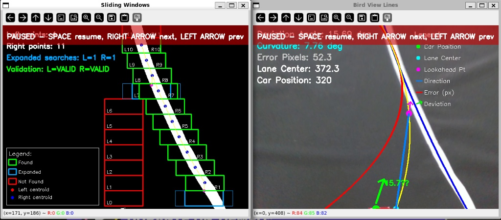
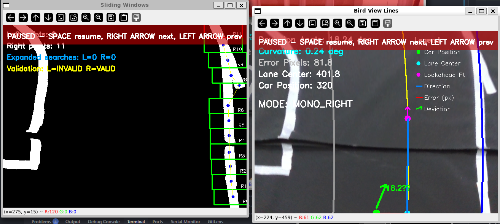
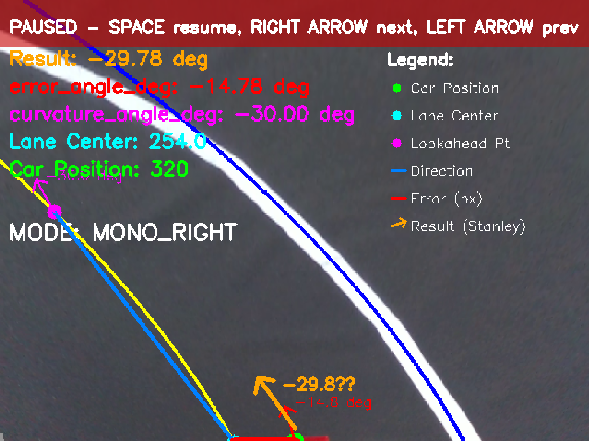

# Detector de lineas



En robótica, **nunca confíes en la matemática ciega**. Tienes que poner límites físicos. Si el resultado es imposible, debes descartar el frame y usar la memoria del anterior.

```
def lines_intersect(fit1, fit2, y_start=0, y_end=480):
    """Verifica si dos polinomios cuadráticos se cruzan en el rango [y_start, y_end]"""
```

!["""Verifica si dos polinomios cuadráticos se cruzan en el rango [ystart, yend]"""](img/f244b3a1090f.png)

- Las cajas verdes dicen `R8`, `R9`, `R10`. El algoritmo **cree** que son puntos del carril **Derecho**.
- Pero físicamente están sobre la línea **Izquierda** (a la izquierda de la pantalla).
- Como el algoritmo piensa "Encontré la Derecha", activa el `MODE: MONO RIGHT` y trata de proyectar la izquierda restando el ancho... mandando el carril virtual fuera del mapa (a la posición 1440).

Aca vemos como detalles de la pista confunden al histograma y se propaga el error al polyfit



Mejorando la vista debug, ahora se entiende mejor que esta haciendo el Stanley modificado que tenemos


