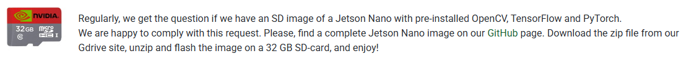

# Crear una imagen custom

Por el tiempo que lleva configurar todo, se ve interesante la posibilidad de crear imagenes una vez que tenemos algo funcionando y estable, por ejemplo, OpenCV compilado con CUDA. algo similar a lo que hacen aca.

Si bien existen formas “oficiales”, terminan siendo incompatible scon la Orin Nano, y no se encuentra bien una guia de como usarlas, entonces, ya que en el fondo Jetpack es ubuntu, vamos a usar una approach mas generico

La idea es crear un zip de la microsd completa, el problema es el tamaño, si la SD es de 256, el zip va a ser tambien de 256, entonces ahi entra en juego el tamaño de la particion. Se busca achicar lo maximo posible, asi quedan imagenes “livianas”, como hicieron con esa de CUDA

## 4) ¿Cómo hacen las imágenes custom tipo QEngineering?

Exactamente así:

① Flashean normalmente con SDK Manager (sin achicar)

② Instalan JetPack, OpenCV, CUDA, etc.

③ Apagan la Jetson

④ Achican la partición **con GParted** en Linux

⑤ Hacen una imagen (`dd` + compresión)

Resultado → imagen minimalista de 7–8 GB.

Esto funciona **siempre**.
