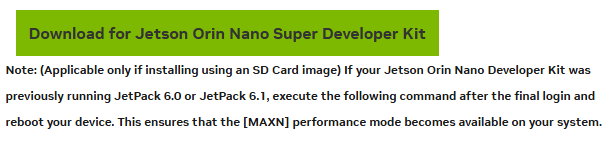
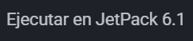
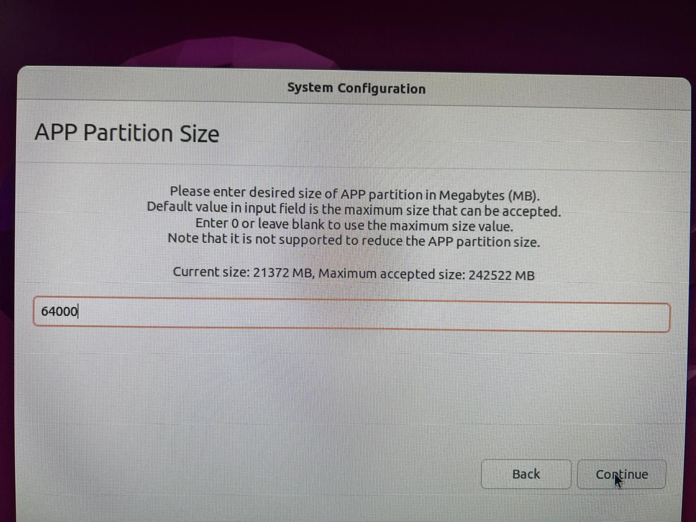
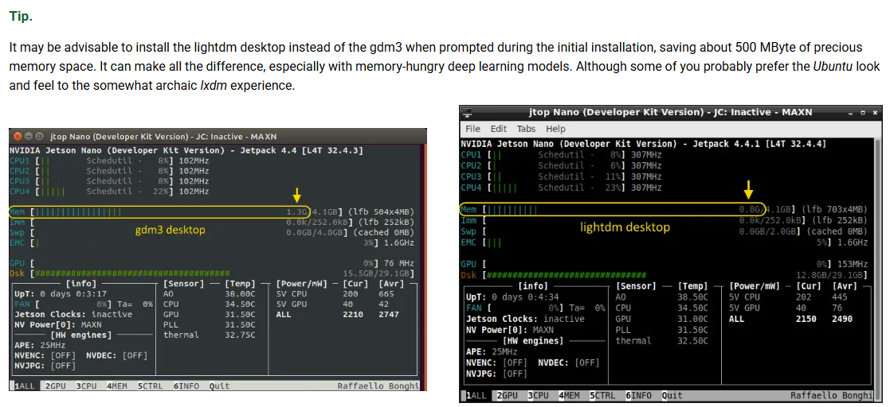
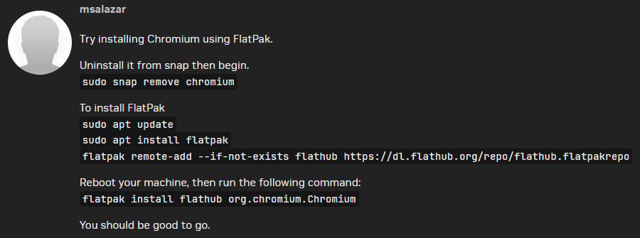
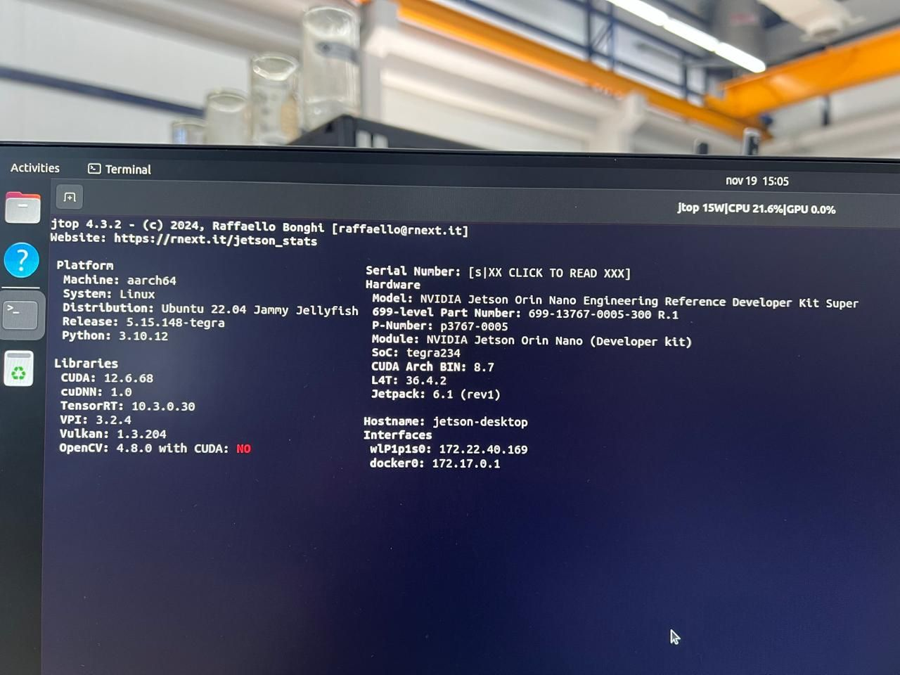
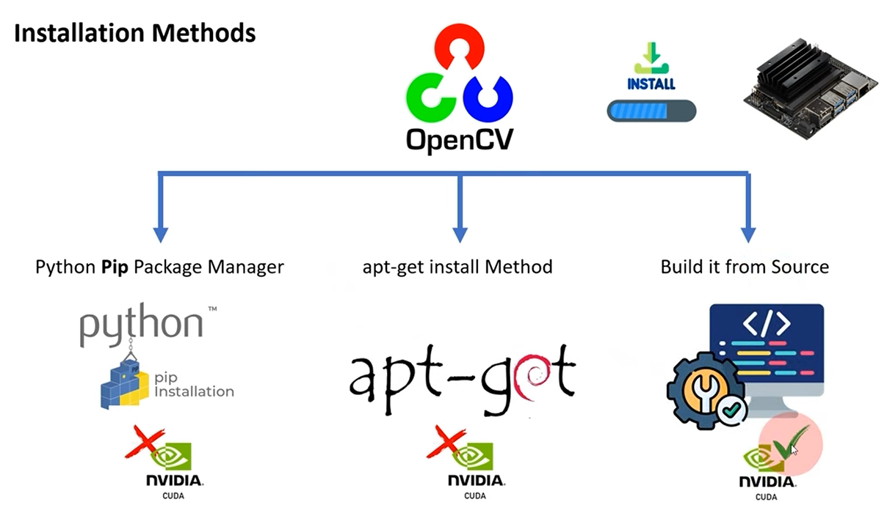
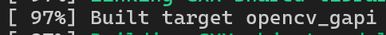
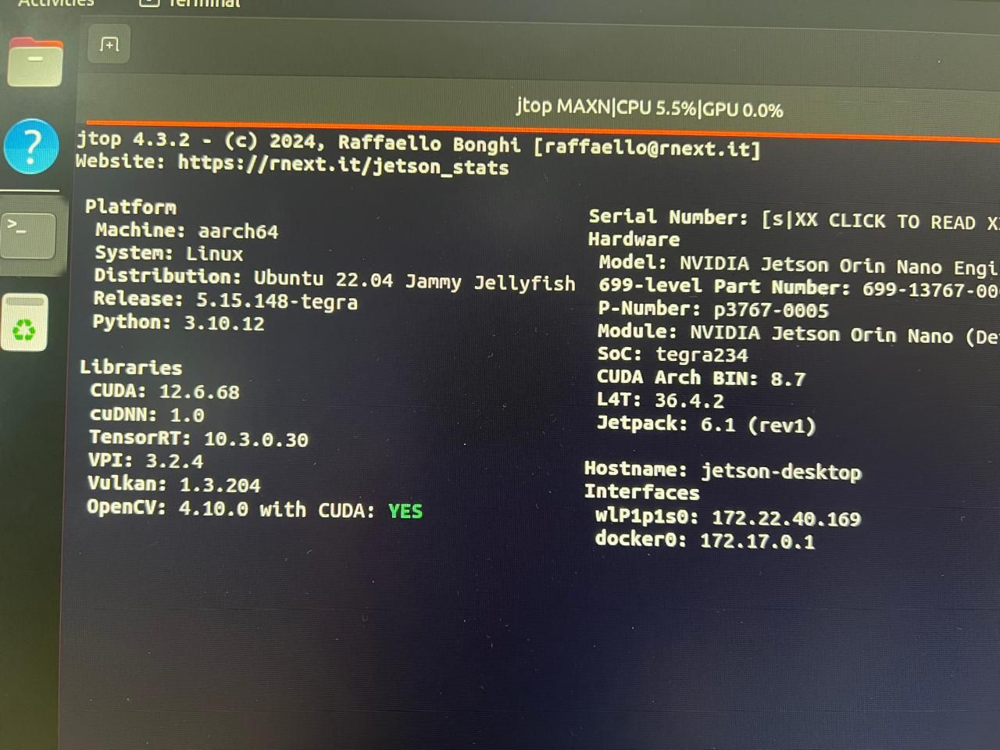
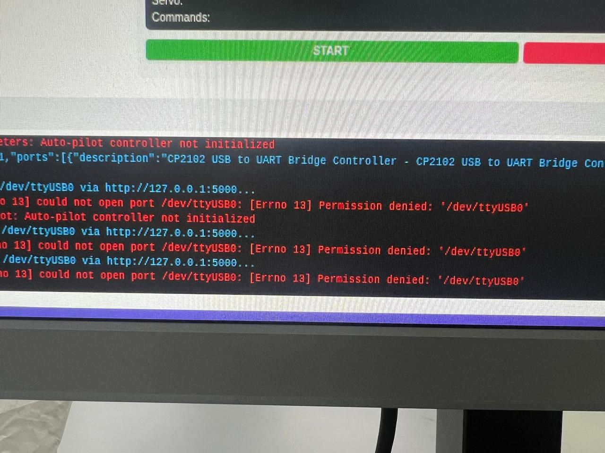

# Jetson Nano - From flash to success

!!! info "Sobre las capturas de esta pagina"
    Algunas imagenes son capturas de documentacion, foros o material de terceros,
    reproducidas con fines ilustrativos y citando la fuente al pie de cada una.
    Los derechos pertenecen a sus respectivos autores.

Lo primero es flashearla desde cero. Hay dos opciones:

- Bootear desde la imagen instalada en una micro sd
- Usar el SDK Manager

Si bien el SDK Manager puede ser mejor de utilizar, ya que no solo instala el SO sino que tambien te permite configurar mas cosas, tiene algunas complejidades extra

- Necesitamos puentear dos pines para ponerla en modo recovery
- Conectarla por USB A - USB C a la Host PC
- La Host PC tiene que ser Ubuntu (no cualquier version)

Para evitar esto, vamos a reinstalar para tener un entorno limpio, pero desde la micro sd directamente.

Lo primero es descargar la imagen, como nosotros ya hicimos la actualizacion de firmware y teniamos funcionando Jetpack 6.x con el modo MAXN, vamos a usar esta imagen 

*Captura de pantalla. Fuente: [NVIDIA — JetPack SDK 6.1](https://developer.nvidia.com/embedded/jetpack-sdk-61) — todos los derechos pertenecen a su autor.*

*\*la unica diferencia entre Orin Nano y Orin Nano Super es haberle habilitado el MAXN, la placa es exactamente la misma\**

En cuanto a las versiones, vamos a usar Jetpack 6.1, debido a que Ultralytics en su guia no tiene la version para 6.2, asi evitamos problemas

*Captura de pantalla. Fuente: [Ultralytics — Guia NVIDIA Jetson](https://docs.ultralytics.com/es/guides/nvidia-jetson/#run-on-jetpack-61) — todos los derechos pertenecen a su autor.*

Para evitar hacer uso de la particion completa de la SD (256), vamos a usar 64gb, de esa forma la .img backup sera mas liviana

Recomendacion 1: Meter 50.000MB, por las dudas, asi se puede clonar a una sd de 64gb sin problemas (se puede agrandar, pero no achicar)→ todavia no lo intente

*Recomendacion 2: Si bien nostros tenemos 6GB de ram con la Orin Nano, no viene mal tener un poco mas*

## Problema de snap

Como lo primero que vamos a intentar es abrir Chromium o abrir la camara, vamos a tener que solucionar este problema: no podemos abrir chromium ni la app de la camara, ya que snap no funciona en la jetson luego de una actualizacion que hicieron, y la solucion es recompilar el kernel. Para evitar esto, vamos a usar otro approach.

*Captura de pantalla. Fuente: [Foro de desarrolladores de NVIDIA](https://forums.developer.nvidia.com/t/jetson-orin-nano-browser-issue/338580/33) — todos los derechos pertenecen a su autor.*

Ahora que tenemos flatpak, ya instalamos chromium y tambien vamos a instalar una app para abrir la camara, en este caso, [snapshot](https://flathub.org/en/apps/org.gnome.Snapshot). Por supuesto, instalamos estas aplicacion usando `flatpak` y no `snap`

## Jetson Stats

Lo siguiente que vamos a hacer es instalar `jetson-stats`, que nos permite ver la version de jetpack que tenemos instalada, junto a otras metricas relevantes.

[https://github.com/rbonghi/jetson_stats](https://github.com/rbonghi/jetson_stats)

Ya tenemos jetson-stats con su comando `jtop` funcionando (luego de hacer reboot), y nos aparece perfectamente la version de Jetpack: 6.1

## Recompilar OpenCV con CUDA

Como vemos, si bien Jetpack ya trae la libreria de OpenCV instalada, tenemos el problema de que no esta compilado para ser usado con CUDA. Osea, no estamos aprovechando tener una GPU dedicada.

Como explican en este video, instalar la version compatible con cuda no es algo que se pueda hacer directamente, ya que hay que recompilar la libreria desde cero.

*Captura de pantalla. Fuente: [Video de YouTube](https://www.youtube.com/watch?v=6DBhDK_JCEY) — todos los derechos pertenecen a su autor.*

Por suerte, existen algunos [scripts](https://github.com/AastaNV/JEP/blob/master/script/install_opencv4.10.0_Jetpack6.1.sh) que hacen esto (sacado de un [foro de Nvidia](https://forums.developer.nvidia.com/t/opencv-4-9-0-build-with-cuda-failed-on-agx-orin-jetpack-6-1-with-previously-provided-script/313080))

- Recomendacion: correrlo directamente desde la jetson, sin SSH, porque sino se cuelga la conexion y te quedas sin saber si termino o que paso. A mi me paso y tuve que correr los ultimos comandos del script manualmente, pero es preferible evitar esto.

Aca tardo mucho sin moverse, pero es normal

Perfecto, sin siquiera reiniciar, ya podemos ver con `jtop `que openCV with CUDA esta habilitado

Esta era otra opcion, pero no hizo falta probarla: [https://qengineering.eu/install-opencv-on-jetson-nano.html](https://qengineering.eu/install-opencv-on-jetson-nano.html)

## Instalar Ultralytics y usarlo directo desde python

Ahora, vamos a instalar ultralytics para usar YOLO, desde su [guia](https://docs.ultralytics.com/es/guides/nvidia-jetson/#run-on-jetpack-61)

Si bien en las guia de ultralytics muestran la posibilidad de usar docker y ahorrarse mucha configuracion, no es una gran idea, ya que agregamos capas de complejidad al sistema.

El comando `pip install ultralytics[export]` no hay forma que funcione, siempre termina tirando error, incluso despues de estar ejecutando toda la noche

![El comando pip install ultralytics[export] no hay forma que funcione, siempre termina tirando error, incluso despues…](img/f482b526e0fc.jpg)

![El comando pip install ultralytics[export] no hay forma que funcione, siempre termina tirando error, incluso despues…](img/ce243e2b9a7c.png)

**Solucion**: Para seguir la guia, correr `pip install ultralytics`, sin el export\[\]. El export lo que hace es instalar muchas otras dependencias, pero como jetpack es una version de ubuntu custom con librerias ya instaladas, no hizo falta.

Ya en este momento, tenemos todo listo, openCV con cuda y ultralytics. Todo esto fue usando pip install a nivel global, por lo cual, no deberiamos nunca crear un venv y volver a instalar opencv o ninguna que ya tengamos, ya que no vamos a aprovechar todo esto que instalamos. Ademas, para evitar romper, por nada del mundo se deberia volver a correr algun `pip install` de forma global, para evitar romper dependencias. 

Entonces, para correr el codigo, muchas veces vamos a tener que instalar otras librerias que no estan en el entorno global, para eso, podemos crear un venv usando el comando `python3 -m venv venv --system-site-packages` . De esta forma, el venv va a usar las librerias globales siempre que se pueda, pero nos permite instalar otras sin tocar la instalacion global.

Esto se puede cheqeuar corriendo dentro del venv este comando, para saber si openCV esta usando CUDA.

`python - << 'EOF'
import cv2, sys
print("cv2:", cv2.``file``)
print("from venv, Python:", sys.version)
print(cv2.getBuildInformation())
EOF`

El path de cv2 deberia devolver algo como `cv2: /home/jetson/.local/lib/python3.10/site-packages/cv2/``init``.py`, lo cual significa que incluso estando andentro del venv, esta usando el opencv global

## Problema de permisos con el puerto ttyUSB

Cuando intentemos ya correr el codigo, vamos a tener un problema relacionado a los permisos de acceso al puerto

Para solucionar esto, vamos a agregar al usuario actual al grupo `dialout`

## Auto startup

Para hacer que el script de [dashboard.py](http://dashboard.py) arranque solo, y el auto este corriendo el servidor luego de enchufarlo (sin necesidad de conectarse por ssh para correr el script), vamos a crear un script de arranque `startup.sh`, y creamos un archivo de systemd

- [Autostart de Aplicaciones en Jetson usando Systemd](autostart-de-aplicaciones-en-jetson-usando-systemd.md)

## Imagen custom - Post Entrega Final

Ya, habiendo hecho todo esto, puede surgir la necesidad de crear una imagen de la sd, que sirva como recovery. Si bien la sd va a quedar en el laboratorio, se va a crear una imagen booteable que permite tener todo funcionando como el dia de la entrega.

- [Crear una imagen custom](crear-una-imagen-custom.md)

## Mejoras

- [Mejoras en general](mejoras-en-general.md)
