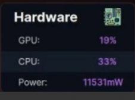
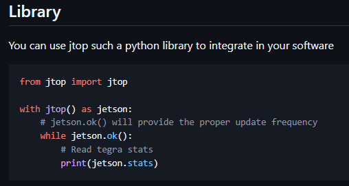
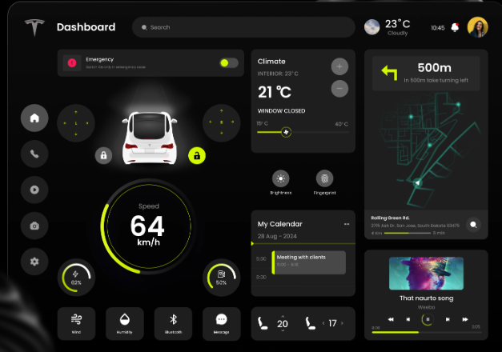

# Mejoras en general

!!! info "Sobre las capturas de esta pagina"
    Algunas imagenes son capturas de documentacion, foros o material de terceros,
    reproducidas con fines ilustrativos y citando la fuente al pie de cada una.
    Los derechos pertenecen a sus respectivos autores.

### Mejoras en el dashboard

Mostrar informacion de la jetson

Por ejemplo, usando la libreria de jetson-stats con el comando `jtop` para el dashboard

*Captura de pantalla. Fuente: [rbonghi/jetson_stats](https://github.com/rbonghi/jetson_stats) — todos los derechos pertenecen a su autor.*

Boton de emergencia (solo es ilustrativo, el boton ya lo tenemos pero no parece un boon de emergencia)

Cambiar el CSS por algo asi, (rojo en lugar de ese amarillo/verde)

*Captura de pantalla. Fuente: [Tesla Car UI Dashboard, por su autor en Dribbble](https://dribbble.com/shots/23396081-Tesla-Car-UI-Dashboard) — todos los derechos pertenecen a su autor.*

### Arquitectura de Conectividad Híbrida: Independencia y Telemetría

Actualmente, aunque el vehículo opera mediante **Edge Computing** (procesamiento local), la visualización y depuración dependen de una conexión a Internet externa e infraestructura de terceros (routers). Esto introduce latencia variable y puntos de falla innecesarios en un sistema crítico.

Para resolver esto, proponemos una arquitectura de **Doble Interfaz de Red** que separa el tráfico de control del tráfico de internet:

1. **Red Local Crítica (Módulo M.2 Interno):** La tarjeta Wi-Fi principal de la Jetson se configurará en modo **Access Point (AP)**. Esto genera una red privada de alta velocidad y baja latencia, permitiendo conectar el dashboard y visualizar video en tiempo real de forma directa (similar a una conexión cableada en un tablero de instrumentos), eliminando la dependencia del entorno.
2. **Red de Servicios e Internet (Dongle USB):** Se utilizará una interfaz secundaria (adaptador USB) dedicada exclusivamente a la conexión **Cliente (Station Mode)**. Esto asegura el acceso a Internet para desarrollo, actualizaciones y telemetría remota (gestión de flota similar a Waymo).
