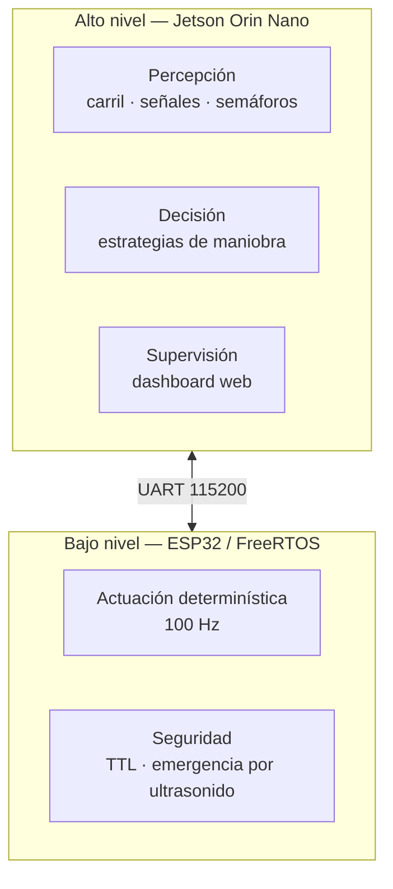

# Arquitectura

El sistema se reparte entre **dos computadoras** con responsabilidades deliberadamente
distintas, unidas por un enlace serie.

## Por qué dos computadoras

La división no es arbitraria: separa lo que necesita **potencia de cómputo** de lo
que necesita **garantías de tiempo**.

| | Brain (Jetson) | VCU (ESP32) |
|---|---|---|
| Prioriza | Throughput de inferencia | Determinismo de ciclo |
| Sistema | Linux (L4T) — no es tiempo real | FreeRTOS — tiempo real |
| Si se cuelga | El auto frena solo | El auto es inseguro |
| Latencia típica | Decenas de ms, variable | 10 ms, fija |

Un detector de objetos sobre Linux no puede dar garantías de latencia: un pico de
GC, una recarga de modelo o el scheduler pueden costar cientos de milisegundos. Por
eso el lazo de control que mueve el motor **no vive ahí**. El ESP32 corre a 100 Hz
fijos y trata los datos de la Jetson como una sugerencia con fecha de vencimiento.

!!! tip "El mecanismo clave: TTL"
    Cada comando que llega por UART tiene un tiempo de vida. Si el ESP32 no recibe
    uno nuevo dentro de la ventana, considera el dato rancio y lleva el vehículo a
    estado seguro. Es lo que hace que un cuelgue de la Jetson sea un frenado y no
    un choque.

## Los documentos

- **[VCU — ESP32](vcu.md)** — Documento de Arquitectura de Software del control de
  bajo nivel: arquitectura time-triggered, mailboxes, core pinning, TTL.
- **[Brain — Jetson](brain.md)** — SAD del subsistema de percepción y navegación:
  controladores paralelos, inyección de dependencias, control jerárquico.
