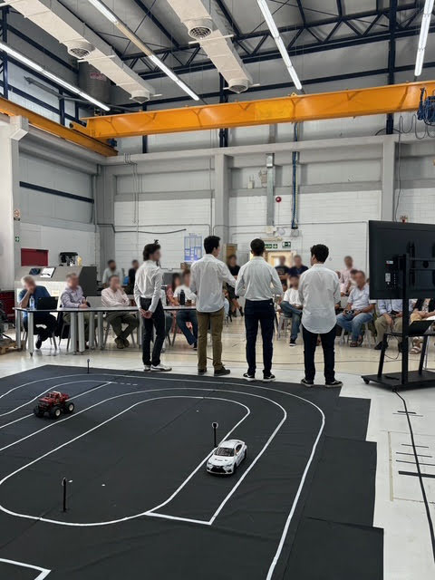
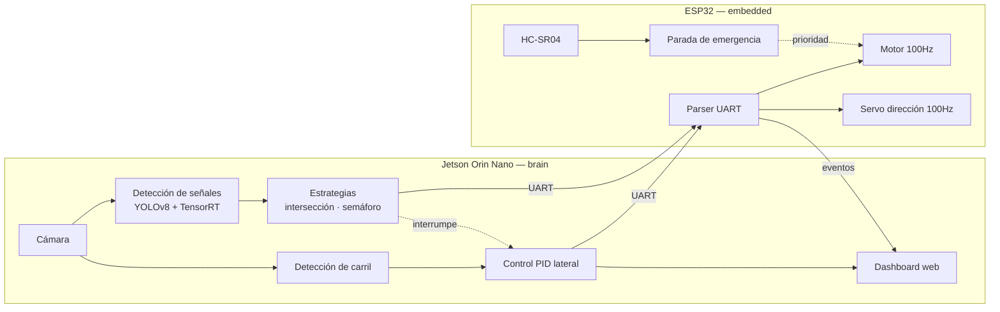

# Robot Autónomo de Laboratorio { .hero__title }

  Bosch Future Mobility Challenge
  Escala 1:10
  Universidad Austral

Vehículo autónomo a escala capaz de mantenerse en carril, reconocer señales de
tránsito y semáforos, y reaccionar ante obstáculos, sobre una maqueta construida
en el laboratorio.

Este sitio reúne la documentación técnica del proyecto, el informe de tesis
completo, los resultados de entrenamiento y la bitácora de cómo se fue
construyendo.

  <a href="timeline/">Cómo llegamos acá</a>
  <a href="arquitectura/">Arquitectura</a>

<figure class="hero__figure" markdown>
{ .hero__crop }
<figcaption class="hero__caption">
La defensa del trabajo de grado: el equipo frente al jurado, con la pista y los
vehículos en primer plano.
</figcaption>
</figure>

---

## Por dónde empezar

-   **:material-timeline-clock: [Cómo llegamos acá](timeline.md)**

    La bitácora del proyecto: de un trabajo práctico de la materia Visión
    Artificial a un auto que maneja solo.

-   **:material-sitemap: [Arquitectura](arquitectura/index.md)**

    Los dos subsistemas —VCU sobre ESP32 y Brain sobre Jetson— y el protocolo UART
    que los une.

-   **:material-eye: [Visión artificial](vision/index.md)**

    El detector YOLOv8, los datasets, y los informes de entrenamiento con métricas.

-   **:material-notebook: [Bitácora de laboratorio](archivo/notion/jetson/index.md)**

    Puesta a punto de la Jetson y del detector de líneas, paso a paso.

## El sistema en una imagen

La frontera entre los dos bloques es física —dos computadoras distintas— y está
definida por el enlace UART. El ESP32 nunca confía
en la Jetson: valida la frescura de cada dato con un **TTL** y frena solo si el
enlace se cae.

<figure class="band" markdown>
{ .band__portrait }
<figcaption>
Raúl: cámara Intel RealSense sobre el mástil, Jetson Orin Nano, sensor
ultrasónico en soporte impreso y chasis Tamiya 1:10 en MDF cortado.
</figcaption>
</figure>

## Los repositorios

| Repo | Qué contiene | Plataforma | Licencia |
|---|---|---|---|
| [`brain`](https://github.com/Robot-Autonomo-de-Laboratorio-BFMC/brain) | Percepción, navegación, estrategias de maniobra y dashboard | Jetson Orin Nano / Python | — |
| [`embedded`](https://github.com/Robot-Autonomo-de-Laboratorio-BFMC/embedded) | Firmware de control de bajo nivel, seguridad, UART | ESP32 / FreeRTOS | **MIT** |
| [`vision-artificial`](https://github.com/Robot-Autonomo-de-Laboratorio-BFMC/vision-artificial) | Entrenamiento YOLOv8, datasets, informes, inferencia | Colab / Docker | — |
| [`*.github.io`](https://github.com/Robot-Autonomo-de-Laboratorio-BFMC/Robot-Autonomo-de-Laboratorio-BFMC.github.io) | Este sitio | MkDocs | — |

!!! info "Sobre el reuso"
    El firmware de la VCU (`embedded`) está publicado bajo **licencia MIT**: se
    puede usar, modificar y redistribuir citando a los autores. Es la pieza pensada
    para que el próximo equipo arranque desde algo que ya funciona, en vez de
    desde cero.

    Los demás repositorios todavía no declaran licencia, lo que por defecto
    significa *todos los derechos reservados*.
