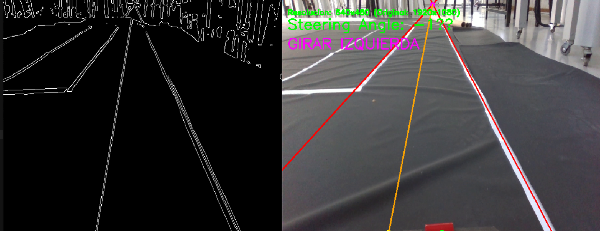
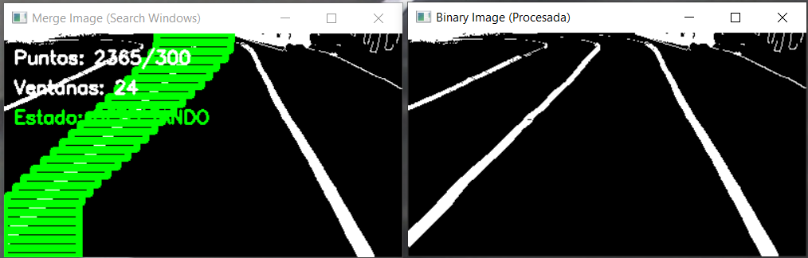
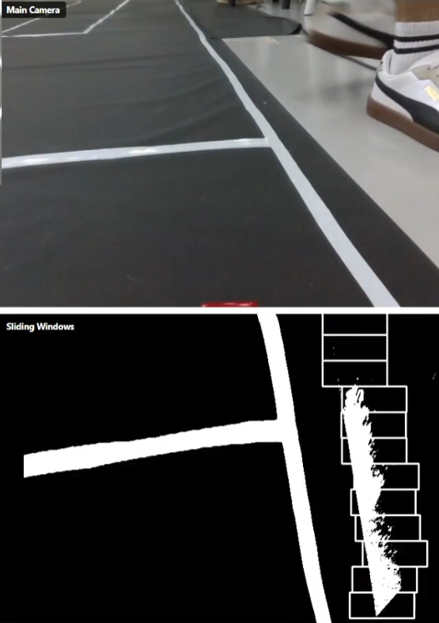
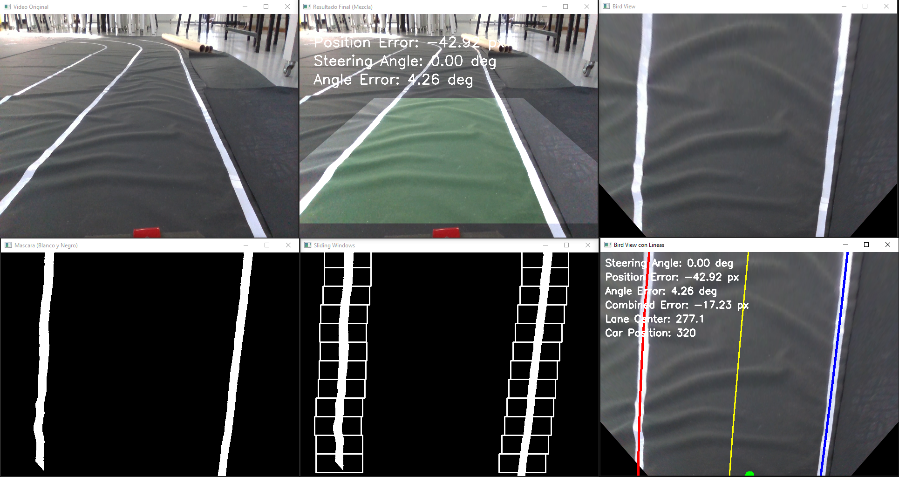

# Análisis Experimental y Resultados

## Configuración del Entorno de Cómputo (Jetson Orin Nano)

El despliegue de algoritmos de procesamiento local (Edge AI) requiere una preparación meticulosa del sistema operativo y los controladores de hardware. A diferencia de una computadora de escritorio estándar, la NVIDIA Jetson Orin Nano consiste en un developer kit que opera sobre una arquitectura ARM64. El proceso de configuración se realizó siguiendo los estándares oficiales de NVIDIA Jetson AI Lab y se dividió en las siguientes etapas críticas:

1. Estrategia de Instalación y Actualización de Firmware: Dado que la Jetson Orin Nano carece de almacenamiento interno, el sistema operativo reside en una tarjeta microSD de alta velocidad. Sin embargo, antes de instalar el entorno definitivo, fue necesario resolver una incompatibilidad de versiones en el "cerebro" interno de la placa (el firmware QSPI).

Al detectar que el firmware de fábrica era obsoleto, el sistema no permitía instalar directamente la versión moderna del sistema operativo. Por ello, se diseñó un proceso de actualización escalonada:

- Flasheo Intermedio: Primero se instaló una versión antigua del sistema (JetPack 5) únicamente con el propósito de que, al arrancar, la placa actualizará automáticamente su firmware interno.
- Instalación Definitiva y Particionamiento: Con el firmware ya actualizado, se procedió a grabar la imagen final del sistema (JetPack 6.1). En este paso, se tomó la decisión técnica de limitar el espacio de la partición principal a 64GB (en lugar de usar toda la tarjeta). Esto es crucial para el mantenimiento: permite generar copias de seguridad del sistema completo que son mucho más ligeras y rápidas de restaurar en caso de fallo, dejando el resto del espacio para datos no críticos.
Para finalizar esta etapa, se configuró el perfil de energía en modo de máximo rendimiento (denominado MAXN), lo que fuerza al sistema a mantener activos sus 6 núcleos de procesador y la tarjeta gráfica dedicada en todo momento.

2. Gestión de Aplicaciones y Conflictos de Software: Durante la validación inicial, se identificó que el gestor de aplicaciones que viene por defecto en Ubuntu (Snap) generaba conflictos graves con el kernel de la Jetson, impidiendo el uso de herramientas básicas como el navegador web o la cámara.

En lugar de realizar modificaciones arriesgadas en el sistema operativo para arreglarlo, se optó por una solución más segura y modular: la adopción de Flatpak como gestor alternativo. Esto permitió instalar las utilidades necesarias (como el navegador web Chromium y la aplicación de cámara) en un entorno aislado, garantizando la estabilidad del sistema principal sin comprometer su integridad.

3. Permisos de Comunicación con el Hardware (Bajo Nivel): Para que el vehículo sea autónomo, la Jetson debe enviar órdenes de tracción y dirección al microcontrolador a través de un cable USB. Inicialmente, el sistema operativo bloqueaba esta comunicación por motivos de seguridad (error de "Permiso denegado").

Para solucionar esto de manera permanente, se modificaron los privilegios del usuario principal, agregándole al grupo de control de dispositivos de hardware (grupo dialout). Esto habilita al software de control a abrir el puerto de comunicación (/dev/ttyUSB0) de forma directa, sin necesidad de intervención manual ni contraseñas de administrador cada vez que se enciende el robot.

4. Optimización de Librerías de Inteligencia Artificial: El desafío más crítico fue asegurar que el procesamiento de imágenes se realizará en la tarjeta gráfica (GPU) y no en el procesador central (CPU), para evitar cuellos de botella.

Recopilación de OpenCV: La librería estándar de visión artificial no viene optimizada de fábrica para este hardware. Fue necesario "reconstruirla" manualmente (compilar desde el código fuente) para activar la aceleración por hardware (CUDA). Esto liberó al procesador principal para otras tareas de lógica de control.

Para organizar el código sin romper estas configuraciones complejas, se utilizó una estrategia de entornos virtuales híbridos (system-site-packages). Esto crea una "burbuja" segura para instalar librerías de Python ligeras, pero con un agujero especial que permite acceder a las herramientas pesadas y optimizadas (como OpenCV con CUDA) que están instaladas en el sistema global.

5. Automatización para Operación Autónoma: Dado que el vehículo opera en la pista sin monitor ni teclado conectado (Headless Mode), el sistema no puede depender de que un humano inicie los programas. Se configuró un servicio de sistema (Systemd) que detecta cuándo el equipo ha terminado de arrancar y ejecuta automáticamente el software de control, permitiendo que el vehículo esté listo para operar segundos después de conectar la batería.

## Validación de Subsistemas

Antes de la integración final del vehículo, se procedió a la validación individual de los módulos críticos: el sistema de actuación (control de bajo nivel) y el sistema de percepción (visión artificial). Esta etapa tuvo como objetivo aislar fallas, verificar la compatibilidad eléctrica y asegurar que los tiempos de procesamiento fueran aptos para la conducción autónoma.

### Pruebas de Actuadores y Electrónica de Control

La validación de la etapa de potencia se centró en garantizar la estabilidad del microcontrolador (ESP32/Arduino) frente al ruido y consumo de los motores. Durante las pruebas preliminares realizadas, se identificaron y resolvieron los siguientes desafíos técnicos:

- En cuanto a la selección del Driver de Tracción, inicialmente, se evaluó el módulo IBT-2 para el control del motor DC. Sin embargo, las pruebas experimentales arrojaron inconsistencias en la inversión de giro (fallo en la señal de retroceso). Ante esta limitación operativa, se optó por migrar al controlador L298N. Las pruebas subsiguientes confirmaron que este puente H gestionaba correctamente las señales PWM para el control de velocidad y dirección de giro, cumpliendo con los requerimientos de tracción del chasis Tamiya.
- En la estabilidad del Servomotor y "Troubleshooting" de Voltaje, uno de los problemas críticos detectados fue el reinicio constante del microcontrolador al accionar el servomotor de dirección. El análisis del circuito reveló que la corriente demandada por el servo provocaba una caída de tensión en el riel de 5V compartido con la lógica de control.
    - Para solucionar esto se segregó la alimentación. Se validó que el sistema funciona de manera estable únicamente cuando el servomotor se alimenta directamente de la fuente de potencia (Batería LiPo), mientras que el microcontrolador mantiene una fuente regulada independiente (o conexión USB para depuración).
    - Para la calibración se realizaron pruebas de rango de movimiento mediante código, definiendo los límites operativos del servo en 50° (izquierda), 105° (centro) y 160° (derecha) para evitar el bloqueo mecánico del sistema de dirección.

### Pruebas de Visión (Detección de Carriles y Señales)

La validación del sistema de percepción se llevó a cabo sobre la unidad de procesamiento NVIDIA Jetson Orin Nano, enfocándose en la capacidad de inferencia en tiempo real. En la configuración del entorno se instaló el sistema operativo Ubuntu sobre el JetPack 6.1 actualizando el firmware de la placa para soportar las librerías modernas de Deep Learning. Esta versión fue seleccionada por su compatibilidad con la guía oficial de Ultralytics para YOLOv8 en placas Jetson. Se integró inicialmente una cámara USB estándar para la captura de video, validando la comunicación mediante scripts básicos en Python con la librería OpenCV.

Rendimiento del Modelo YOLOv8 CPU vs. GPU Para la detección semántica (señales de tráfico y semáforos), se utilizó el modelo customizado (best.engine) entrenado previamente. Se realizó una prueba comparativa de rendimiento para justificar empíricamente el uso de aceleración por hardware:

- Ejecución en CPU: Las primeras pruebas corriendo el modelo sobre el procesador central (ARM Cortex) arrojaron una latencia crítica de aproximadamente 6 segundos entre fotogramas. Este retraso hacía inviable cualquier maniobra de control reactivo; el vehículo ya habría cruzado la intersección antes de procesar la señal de "Stop".
- Ejecución en GPU (CUDA): Tras la instalación de los drivers de CUDA y la optimización del código para utilizar los Tensor Cores de la GPU, se logró reducir drásticamente la latencia, alcanzando una tasa de inferencia fluida en tiempo real (aproximadamente 15-20 FPS).
El código de validación final permitió visualizar las bounding boxes sobre el feed de video en vivo, confirmando que la Jetson es capaz de identificar las señales de la pista con un nivel de confianza adecuado (\>0.7) mientras mantiene la comunicación asíncrona con el microcontrolador ESP32.

#### Evolución Iterativa del Algoritmo de Carriles

A diferencia de la detección de objetos, la navegación dentro de los límites del carril requirió un proceso de desarrollo incremental. Se probaron y descartaron múltiples aproximaciones algorítmicas hasta alcanzar la solución robusta actual. Este proceso iterativo se dividió en tres fases experimentales:

Aproximación Geométrica con transformada de Houghs. Se implementó un detector clásico basado en la detección de bordes (Canny) y la Transformada de Hough Probabilística. Si bien el algoritmo detectaba líneas rectas con eficacia, demostró ser inestable en las secciones curvas y en la línea central discontinua. El temblor en la detección generaba comandos de dirección erráticos, haciendo que el vehículo oscilara al intentar mantenerse centrado.

<figure markdown="span">

<figcaption>Figura 48: Aproximación mediante Transformada de Hough.</figcaption>
</figure>

Aproximación con una estrategia de pre-procesamiento híbrido que fusiona la detección estructural de bordes (filtro Canny) con la segmentación del canal Verde (RGB), logrando un contraste superior al enfoque HSV anterior. Para la reconstrucción de la trayectoria, se sustituyó el ajuste polinomial simple por una resolución matricial de Mínimos Cuadrados, integrando un búfer de suavizado temporal de 5 cuadros. Este actúa como un filtro pasa-bajos, eliminando el ruido de alta frecuencia y estabilizando la respuesta del actuador de dirección. Pero fue descartada por inconsistencias en la detección.

<figure markdown="span">

<figcaption>Figura 49: Estrategia de Pre-procesamiento Híbrido</figcaption>
</figure>

Se utilizó ventanas deslizantes básicas (Sliding Windows) para solucionar el problema de la curvatura, migrando a un enfoque de visión cenital (Bird 's Eye View) aplicando histogramas y ventanas deslizantes. Esta técnica mejoró significativamente el seguimiento en curvas. Sin embargo, en el algoritmo, si una ventana perdía momentáneamente la línea (por reflejos en la lona o espacios vacíos del segmentado), el ajuste polinomial fallaba, enviando al auto fuera de la pista.

<figure markdown="span">

<figcaption>Figura 50: Implementación inicial de Ventanas Deslizantes. La detección mejora, pero es susceptible a ruido y pérdida de trazo.</figcaption>
</figure>

Algoritmo Robusto con Memoria y Lógica de Estados fue una solución definitiva consistió en refinar el método de ventanas deslizantes agregando una capa de inteligencia lógica. Se implementaron "Filtros de Sanidad" para validar que el ancho del carril sea físicamente posible y una "Máquina de Estados" que permite al vehículo navegar usando una sola línea si la otra se pierde. Como se observa en la figura, el sistema actual es capaz de reconstruir el carril virtualmente incluso con información parcial, logrando una navegación suave y continua a través de la pista compleja diseñada.

<figure markdown="span">

<figcaption>Figura 51: Versión final del algoritmo.</figcaption>
</figure>

## Integración Final

Una vez validados de forma independiente los subsistemas de actuación y control embebido por un lado, y el sistema de percepción y toma de decisiones sobre la Jetson Orin Nano por el otro, se procedió a la integración final del vehículo. El objetivo de esta etapa fue acoplar la arquitectura de alto nivel (“Brain”) con el proyecto embebido sobre ESP32 y la plataforma mecánica, de manera tal que el prototipo pudiera completar de forma autónoma un recorrido en la pista de laboratorio.

La estrategia de integración siguió un enfoque por capas, respetando la jerarquía Master–Slave definida en la arquitectura del sistema. En una primera instancia se conectó la Jetson al ESP32 mediante el enlace UART y se verificó el protocolo de comandos de velocidad y dirección, utilizando el auto en recorridos muy breves. Esto permitió comprobar que las tramas generadas por el *CommandSender* eran correctamente interpretadas por las tareas de control *MotorTask* y *SteerTask *en el firmware del microcontrolador, manteniendo la cadencia temporal definida por la Arquitectura Activada por Tiempo y el mecanismo de Time-To-Live para seguridad. En esta fase también se terminaron de ajustar los límites de movimiento del servomotor y se comprobaron en conjunto las soluciones de segregación de alimentación implementadas en la etapa de potencia.

La segunda instancia de integración consistió en habilitar el seguimiento de carril dentro de la pista ya armada. Para ello se conectó el módulo de Lane Detection al controlador PID de dirección, activando el flujo “normal” de operación donde el *AutoPilot *recibe, en cada ciclo, el error lateral calculado a partir de la homografía y las ventanas deslizantes sobre la imagen de la cámara. Las pruebas se realizaron principalmente en el laboratorio, complementadas con ensayos breves en aulas cercanas y en ámbitos domésticos, procurando mantener condiciones lumínicas similares a las de diseño del entorno de validación. En esta etapa se trabajó sobre el punto de operación óptimo de velocidad, ya que la potencia del motor debía ser suficiente para mover el vehículo con todo el hardware embarcado, pero lo bastante baja como para que el tiempo de procesamiento de cada frame fuera compatible con la capacidad de reacción del sistema. La migración del pipeline de visión a la GPU de la Jetson, aprovechando CUDA, resultó clave para reducir la latencia de inferencia y estabilizar el control en curvas y chicanas.

Finalmente, se integró el módulo de detección de señales mediante YOLOv8 al esquema de control. El *SignController* se ejecuta en paralelo al flujo de seguimiento de carril y, cuando válida una detección prioritaria (por ejemplo, una señal de Stop o un cruce peatonal), interrumpe temporalmente al *AutoPilot *para ejecutar la estrategia correspondiente basada en maniobras temporizadas, tal como se había definido en los diagramas de secuencia del capítulo de software. Una vez completada la maniobra, el control vuelve al modo de navegación normal. Con esta configuración, el prototipo es capaz de realizar un recorrido completo sobre la pista mientras el arranque se produce dentro de un carril delimitado, combinando la navegación por carriles con la respuesta a la señalización vial instalada.

La integración final no introdujo problemas estructurales adicionales respecto de los identificados en las etapas de prueba de cada subsistema. Por el contrario, disponer de todos los componentes trabajando en conjunto permitió afinar parámetros críticos (ganancias del PID, velocidad de avance, posición y ángulo de cámara, umbrales de confianza del detector, entre otros) hasta alcanzar un comportamiento autónomo consistente en el entorno de laboratorio.
