# Arquitectura de Software y Control

El diseño del software del vehículo autónomo se fundamenta en una arquitectura distribuida y jerárquica, concebida para desacoplar la lógica de percepción computacional (que requiere altos recursos de procesamiento) del control de actuadores (que exige determinismo en tiempo real). El sistema se divide en dos capas principales de procesamiento que operan de manera asíncrona pero coordinada: el **Nivel Superior (Brain)** y el **Nivel Inferior (Embedded)**.

Esta separación estructural garantiza la robustez del sistema: ante una eventual latencia o saturación en el procesamiento de imágenes en la computadora principal, el microcontrolador mantiene el control físico del vehículo, ejecutando rutinas de seguridad o frenado de emergencia.

## Arquitectura del Sistema

La topología del sistema sigue el patrón **Maestro-Esclavo (Master-Slave)**. La unidad de procesamiento **NVIDIA Jetson Orin Nano** actúa como el maestro, centralizando la toma de decisiones basada en la percepción del entorno. Por su parte, el microcontrolador **ESP32** opera como esclavo, abstrae la complejidad del hardware y ejecuta comandos físicos. La comunicación entre ambos nodos se realiza mediante una interfaz serie (UART) a través de USB, utilizando un protocolo de tramas estandarizado que asegura la integridad de los datos transmitidos.

<figure markdown="span">
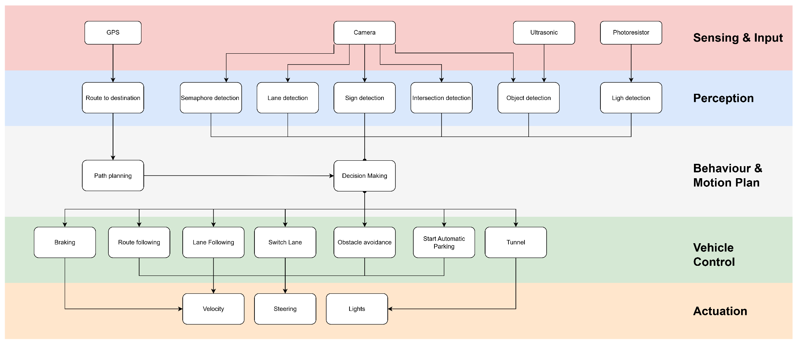
<figcaption>Figura 21: Diagrama de Arquitectura Funcional por Capas</figcaption>
</figure>

## Arquitectura de Alto Nivel (Brain Project)

El módulo denominado **"Brain"** constituye el componente de inteligencia central del vehículo. Se ejecuta sobre un sistema operativo **Linux (Ubuntu/L4T)** en la NVIDIA Jetson Orin Nano. A diferencia del controlador de bajo nivel (ESP32), que opera con lógica reactiva simple, este subsistema gestiona la complejidad de la visión artificial, la orquestación de maniobras temporales y la comunicación con el operador.

### Principios de Diseño

Para garantizar un rendimiento óptimo en tiempo real y la escalabilidad del código, la arquitectura se fundamentó en tres pilares de ingeniería de software:

- Concurrencia y Multithreading: Dado que el procesamiento de imágenes es intensivo, la detección de carriles y la detección de señales se ejecutan en hilos (threads) separados. Esto permite maximizar el uso de los núcleos de la CPU/GPU, asegurando que una caída en el framerate de la red neuronal no bloquee el bucle de control PID de la dirección.
- Inyección de Dependencias: El servidor central actúa como una "fábrica" que instala los controladores y pasa las referencias necesarias entre ellos, facilitando las pruebas unitarias y la modularidad.
- Control Jerárquico Directo: Se estableció una jerarquía de mando donde el subsistema de Señalización (SignController) posee autoridad sobre el subsistema de Navegación (AutoPilot), teniendo la capacidad de interrumpir su ejecución para tomar el control del hardware ante eventos prioritarios (ej. Intersecciones o señales de Pare).

### Estructura Modular del Proyecto

El código fuente se organiza en módulos funcionales que abstraen las capas de visión, lógica de control y hardware. La estructura de directorios implementada es la siguiente:

- dashboard/: Actúa como el punto de entrada (Entry Point). Contiene el servidor Flask que inicializa el sistema y expone una API REST y Streaming de video para la interfaz de usuario (UI).
- lane\_detection/: Encapsula la lógica de navegación autónoma. Incluye el LaneDetector (procesamiento OpenCV), el PIDController y el FilterController para suavizar la dirección.
- sign\_vision/: Módulo de inteligencia artificial. Aloja los pesos del modelo YOLO, el SignController y las implementaciones del Patrón Strategy (strategies/) para maniobras específicas como intersecciones o paradas.
- camera/: Capa de abstracción de hardware (HAL) que permite cambiar transparentemente entre una WebCam estándar y la cámara de profundidad Intel RealSense.
- Command\_sender.py: Interfaz de bajo nivel para la comunicación Serial (UART) con el ESP32.

### Diagrama de Clases y Patrones de Diseño

La interacción estática entre estos módulos se rige por el uso de principios de diseño. Como se observa en el diagrama de clases, se destaca el uso del Patrón Strategy para la gestión de señales. La clase abstracta SignStrategy define una interfaz común, permitiendo que el vehículo cambie su comportamiento dinámicamente sin alterar el código del controlador principal.

<figure markdown="span">
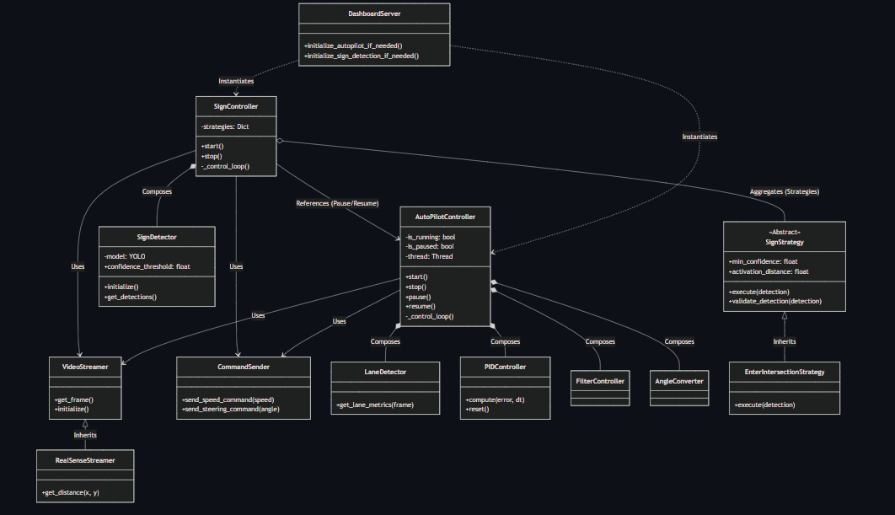
<figcaption>Figura 22: Diagrama de Clases UML del sistema Brain</figcaption>
</figure>

### Dinámica de Ejecución y Flujos de Comportamiento

La operación del vehículo no es lineal, sino que conmuta entre estados de comportamiento. A continuación, se describen los dos flujos principales validados mediante diagramas de secuencia.

A. Flujo Normal: Seguimiento de Carril (Lane Keeping) En condiciones nominales, el vehículo opera bajo el control del AutoPilotController con una frecuencia objetivo de 30 Hz. El ciclo, ilustrado en la Figura \[20\], sigue una lógica de bucle cerrado:

- **Adquisición:** El *VideoStreamer* entrega el último frame disponible.
- **Procesamiento:** El *LaneDetector* calcula la desviación angular respecto al centro del carril.
- **Control:** El *PIDController* computa la corrección necesaria basada en el error actual y acumulado.
- **Actuación:** Si el valor de salida difiere del estado actual, el *CommandSender* transmite la nueva posición del servo al ESP32.

<figure markdown="span">
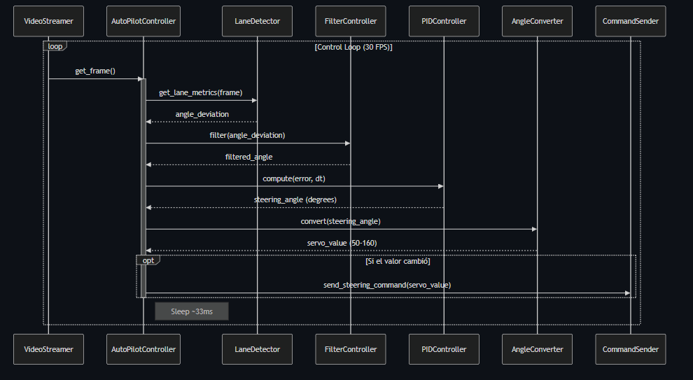
<figcaption>Figura 20: *Diagrama de Secuencia del flujo de Seguimiento de Carril</figcaption>
</figure>

B. Flujo de Interrupción: Detección de Señal Este flujo representa el mecanismo de seguridad y decisión semántica. Corriendo en paralelo a ~15-20 Hz (limitado por la inferencia de YOLO), el SignController monitorea el entorno. Cuando se valida una detección compleja (ej. Intersección) que cumple con los criterios de confianza y distancia, se dispara una interrupción de software:

- **Toma de Control:** El *SignController* pausa explícitamente al *AutoPilotController*, inhabilitando el cálculo PID.
- **Ejecución de Estrategia:** Se instancia la estrategia correspondiente (ej. *EnterIntersectionStrategy*). Esta ejecuta una maniobra "ciega" basada en tiempos (*Time-Based Maneuver*), enviando comandos preprogramados de velocidad y dirección.
- **Retorno de Control:** Al finalizar la maniobra, se reactiva el Autopiloto, reseteando los acumuladores del PID para evitar saltos bruscos.

<figure markdown="span">
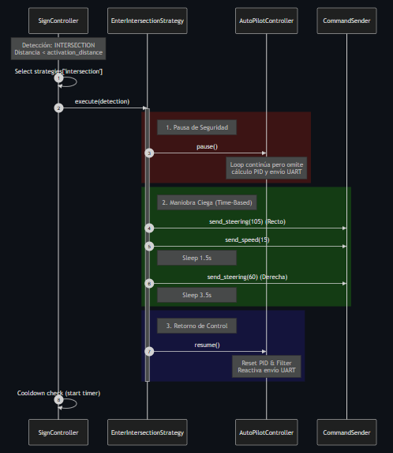
<figcaption>Figura 23: *Diagrama de Secuencia del flujo de Interrupción</figcaption>
</figure>

### Dashboard y Telemetría

El módulo Dashboard cumple una función doble: es el orquestador del arranque (*Bootstrapping*) y la interfaz de control humano-máquina. Desarrollado sobre **Flask**, expone rutas de API para el ajuste de parámetros en tiempo real (*Hot-Tuning*), permitiendo modificar las constantes Kp, Ki y Kd del PID sin necesidad de recompilar o reiniciar el software. La visualización se logra mediante *Server-Sent Events (SSE)*, proporcionando telemetría de baja latencia al navegador del operador.

<figure markdown="span">
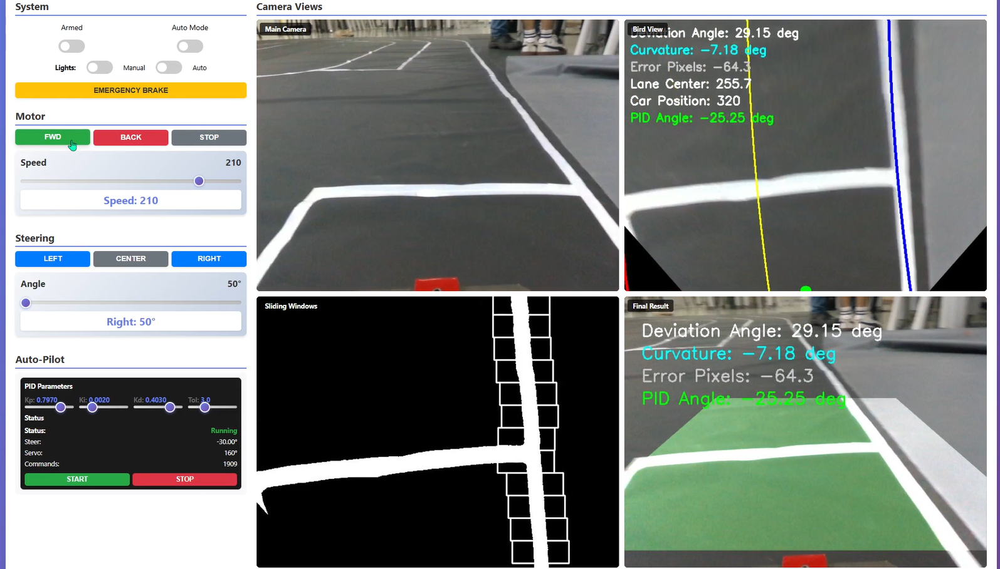
<figcaption>Figura 24: Dashboard elaborado</figcaption>
</figure>

## Arquitectura de Bajo Nivel (Embedded Project)

El subsistema embebido, ejecutado sobre el microcontrolador ESP32, constituye la capa de control crítico del vehículo. A diferencia del alto nivel, diseñado para el rendimiento computacional, esta arquitectura prioriza el determinismo temporal y la seguridad operativa.

### Principios de Diseño: Arquitectura Activada por Tiempo

El sistema implementa una Arquitectura Activada por Tiempo (Time-Triggered Architecture). Las tareas críticas de control no reaccionan aleatoriamente a la llegada de datos, sino que se ejecutan de manera sincrónica a una frecuencia predeterminada. Este enfoque garantiza un ciclo de ejecución constante y predecible, fundamental para esta etapa, donde se necesita asegurar la estabilidad del bucle de control. Los drivers arquitectónicos principales son:

- Determinismo de Ciclo: Las tareas de actuación (MotorTask y SteerTask) mantienen una cadencia estricta de 100 Hz (10ms). Esto asegura que la señal PWM se actualice de forma constante, independientemente de la carga del sistema.
- Multiprocesamiento Asimétrico (Core Pinning): Para evitar que las interrupciones de red afecten el control del motor, se aisló el Core 0 para tareas críticas de seguridad y movimiento, delegando al Core 1 la gestión de comunicaciones (WiFi/UART) y tareas secundarias.
- Seguridad por Diseño (TTL): Se implementa un mecanismo de Time-To-Live en cada comando recibido. Si el enlace de comunicación se pierde y los datos  más allá de un umbral seguro, el vehículo pasa automáticamente a un estado de parada segura.

<figure markdown="span">
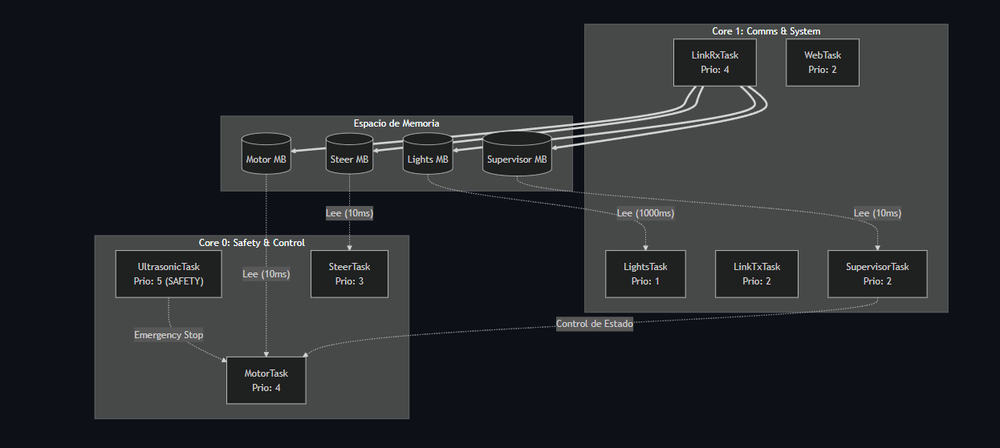
<figcaption>Figura 25: *Diagrama de Despliegue y asignación de núcleos</figcaption>
</figure>

### Estrategia de Comunicación Inter-Procesos (IPC)

La gestión de datos entre las tareas concurrentes utiliza un modelo híbrido que combina la estabilidad del *Polling* con la reactividad de las interrupciones.

**A. Operación Nominal: Polling con Mailbox** Para el flujo de datos estándar (ej. comandos de velocidad), se utiliza un patrón de desacoplamiento Productor-Consumidor mediante "Buzones" (*Mailboxes*).

- **Recepción Asíncrona:** La tarea de recepción (*LinkRxTask*) escribe el dato en el buzón protegido por un semáforo (*Mutex*) tan pronto llega por UART.
- **Ejecución Sincrónica:** La tarea de control (*MotorTask*) despierta cada 10ms, toma la "foto" más reciente del estado del buzón y la aplica. Esto actúa como un filtro natural de paso bajo, ignorando fluctuaciones de alta frecuencia.
**B. Mecanismo de Excepción: Fast-Path de Emergencia** Dado que un ciclo de 10ms podría ser demasiado lento para una colisión inminente, se diseñó un canal de alta prioridad. Cuando el sensor ultrasónico detecta un obstáculo o se recibe un comando de "EMERGENCY STOP", el sistema emite una **Notificación Directa a la Tarea**. Esta señal "despierta" inmediatamente al controlador del motor, interrumpiendo su ciclo de espera y forzando el frenado en un tiempo de reacción **\<1 ms**.

<figure markdown="span">
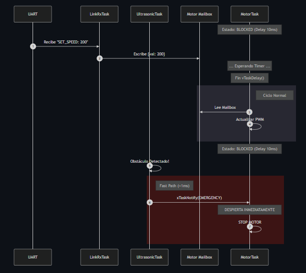
<figcaption>Figura 26: *Diagrama de Secuencia del Ciclo de Control</figcaption>
</figure>

### Estructura de Datos y Supervisión

La integridad del sistema se gestiona mediante la estructura *mailbox\_t*, que encapsula no solo el valor del comando (velocidad/ángulo), sino también su marca de tiempo (*timestamp*) para validar su frescura. Paralelamente, una tarea de supervisión (*SupervisorTask*) monitorea la **Máquina de Estados Global** del vehículo. Esta entidad es responsable de transicionar el sistema entre modos (DISARMED → ARMED → RUNNING) y actúa como un *Watchdog* de alto nivel: si el flujo de datos del "Brain" se interrumpe, el supervisor desarma los motores preventivamente.

### Distribución de Carga y Concurrencia

La asignación estática de tareas a núcleos específicos permite predecir el comportamiento del sistema bajo carga máxima. Como se detalla en la tabla de afinidad, las tareas de tiempo real estricto (*UltrasonicTask*, *MotorTask*) tienen prioridad sobre la telemetría o el control de luces.

| **Núcleo** | **Rol** | **Tareas Asignadas** | **Prioridad** | **Descripción** |
|---|---|---|---|---|
| Core 0 | Safety & Motion | UltrasonicTask | Crítica (5) | Capa de Seguridad: Monitoreo de entorno y prevención de colisiones. Máxima prioridad del sistema. |
| Core 0 | Real-Time Control | MotorTask, SteerTask | Alta (3-4) | Generación de PWM preciso y bucles de control. Aislado de interrupciones de red. |
| Core 1 | Comms Ingress | LinkRxTask | Alta (4) | Recepción y decodificación de alta velocidad (UART/WiFi). |
| Core 1 | System & I/O | WebTask, Supervisor, LinkTx, Lights | Media/Baja (1-2) | Gestión de pila TCP/IP, telemetría, watchdog y control de iluminación. |

Tabla 1: *Tabla de Distribución de Carga (Core Affinity)*

## Implementación de Visión Artificial (YOLOv8)

El sistema de percepción del vehículo se basa en la arquitectura de redes neuronales convolucionales YOLO (You Only Look Once). Tras una fase exploratoria inicial utilizando YOLO v5 para familiarizarse con el flujo de inferencia , el equipo migró a YOLOv8 debido a su arquitectura orientada a objetos (anchor-free) y su mayor eficiencia en dispositivos de borde (Edge AI).

El objetivo del modelo es la detección simultánea y en tiempo real de cuatro categorías de elementos críticos para la navegación en la maqueta: semáforos (discriminando estados rojo, amarillo y verde), señales de tránsito estáticas (Pare, Paso Peatonal, Parking).

### Construcción del Dataset

La calidad del modelo de aprendizaje profundo depende intrínsecamente de la calidad de los datos. Dado que no existía un conjunto de datos único que cubriera todas las necesidades específicas del Bosch Future Mobility Challenge, se optó por una estrategia de Búsqueda, Selección y Fusión utilizando la plataforma Roboflow y repositorios como Kaggle.

Composición y Preprocesamiento Se recopilaron y filtraron imágenes de diversos datasets, seleccionando clases específicas compatibles con la normativa del circuito. El dataset consolidado cuenta con un total de 4,594 imágenes, distribuidas estratégicamente para evitar el sesgo:

- **Conjunto de Entrenamiento (Train Set):** 74% (3,410 imágenes).
- **Conjunto de Validación (Valid Set):** 18% (814 imágenes).
- **Conjunto de Prueba (Test Set):** 8% (370 imágenes).
Clases Definidas El dataset final unificado incluye etiquetas para: trafficlight (general), lightgreen, lightred, lightyellow, stop, crosswalk, parking, priority, roundabout, highway\_entry, highway\_exit, onewayroad y no\_entry.

El proceso de fusión de datasets presentó desafíos técnicos significativos, requiriendo la unificación manual de etiquetas y formatos en entornos de Google Colab.

<figure markdown="span">
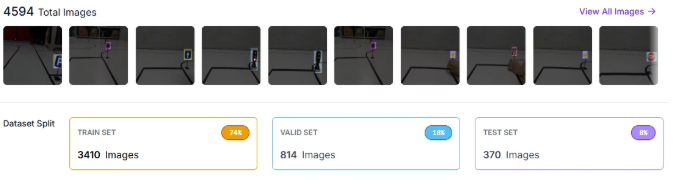
<figcaption>Figura 27: *Distribución del Dataset en Roboflow.</figcaption>
</figure>

### Entrenamiento del Modelo

El entrenamiento se llevó a cabo en la nube utilizando Google Colab, aprovechando la aceleración por hardware mediante GPUs (Tesla T4) y TPUs gratuitas. Esta infraestructura permitió iterar rápidamente sobre diferentes configuraciones de hiperparámetros.

Configuración y Tiempos de Cómputo Se realizaron experimentos comparativos variando la complejidad del dataset y la cantidad de épocas (epochs). Como se detalla en la tabla a continuación, el entrenamiento con el dataset fusionado (Semáforo + Señales) implicó procesar un volumen de 3410 imágenes de entrenamiento, con tiempos de ejecución que oscilaron entre 2.5 minutos (1 época) y 22 minutos (10 épocas).

<figure markdown="span">
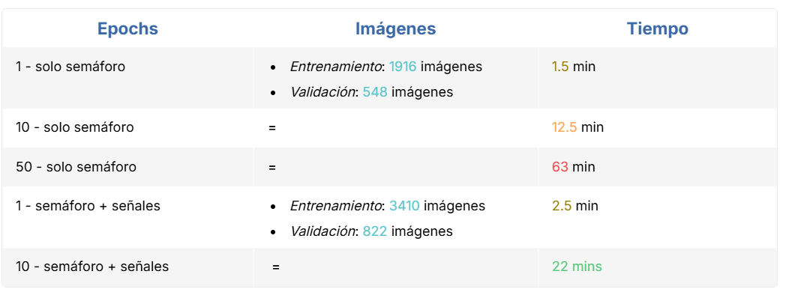
<figcaption>Figura 28: *Comparativa de tiempos de entrenamiento y volumen de datos entre las pruebas de una sola clase y el dataset fusionado.</figcaption>
</figure>

Para mitigar las limitaciones de tiempo de uso en la versión gratuita de Colab, se implementó una rutina de guardado de checkpoints (best.pt, last.pt), permitiendo reanudar el entrenamiento en caso de desconexión del entorno (runtime). La resolución de entrada se estandarizó en 640x640 píxeles, un balance óptimo entre la retención de detalles (necesaria para ver semáforos lejanos) y la velocidad de inferencia (FPS) en la Jetson Orin Nano.

### Resultados

La evaluación cuantitativa del modelo demuestra una evolución notable en la precisión, especialmente al comparar el entrenamiento inicial de una sola clase contra el entrenamiento del dataset fusionado. Análisis de Métricas (mAP, Precisión y Recall) En la Figura a continuación se presentan las tablas de métricas obtenidas.

- Figura 29 Izquierda (Solo Semáforo): Se observa un comportamiento lineal clásico. Con 1 época, el modelo apenas aprende (mAP@0.5 de 0.482), requiriendo hasta 50 épocas para alcanzar una precisión robusta de 0.986.
- Figura 29 Derecha (Fusionado): Se evidencia la potencia del Transfer Learning de YOLO v8. Incluso con 1 sola época, el modelo alcanza un mAP@0.5 de 0.995. Al llegar a las 10 épocas, se logra un Recall del 1.000, lo que implica que el modelo no presenta "falsos negativos" (no omite ninguna señal), un factor crítico para la seguridad en conducción autónoma.

<figure markdown="span">
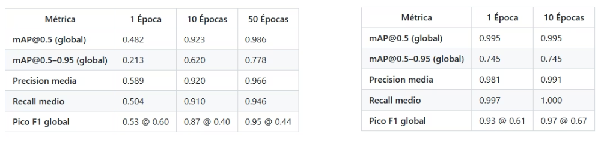
<figcaption>Figura 29:* Comparativa de métricas de rendimiento.</figcaption>
</figure>

Las pruebas de inferencia sobre video confirmaron los datos tabulados. La matriz de confusión (presentada en anexos) muestra una alta diagonalidad, indicando una separación clara entre clases con mínimos errores de clasificación entre el fondo (background) y los objetos de interés.

<figure markdown="span">
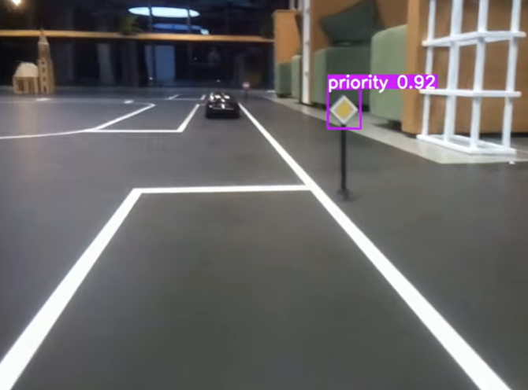
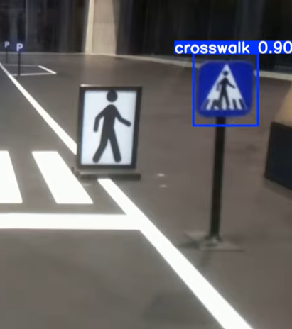
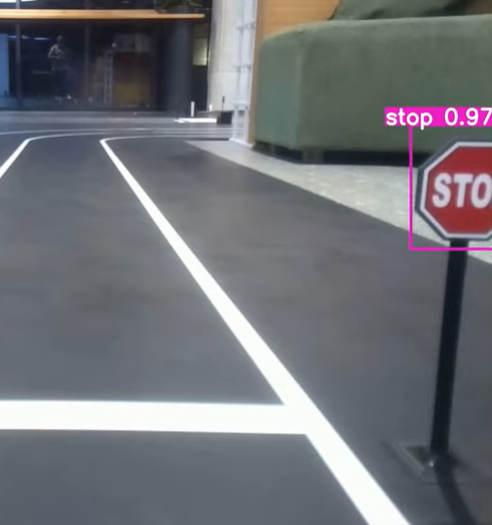
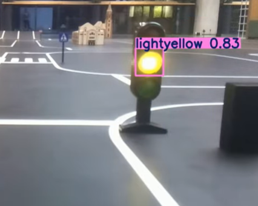
<figcaption>Figura 30: Detección de señales</figcaption>
</figure>

### Desafíos Identificados en Campo

A pesar de las métricas sintéticas casi perfectas, las pruebas físicas en la pista revelaron desafíos propios del mundo real:

- Falsos Positivos por Reflejos: La superficie brillante de la lona original generaba detecciones espurias. Esto se mitigó cambiando el material de la pista a Tela Bagún negro mate.
- Confusión Lumínica: En condiciones de luz natural no controlada, reflejos amarillos intensos fueron ocasionalmente clasificados como la luz ámbar del semáforo.

### Solución Implementada

Se estableció un umbral de confianza mínimo del 60% (conf \> 0.60) en el código de inferencia para filtrar predicciones débiles y se implementó el uso de máscaras de región de interés (ROI) para futuras iteraciones.
