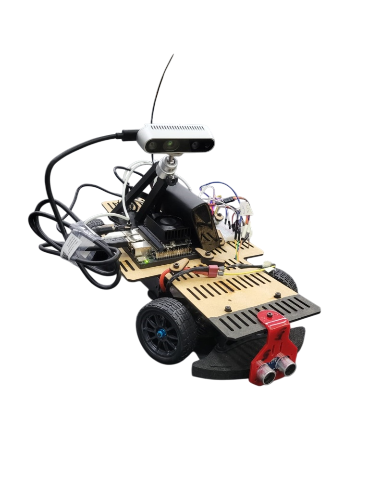

# Conclusiones del proyecto

La culminación del proyecto "Robot Autónomo de Laboratorio - BFMC" representa el cumplimiento satisfactorio del objetivo fundamental trazado al inicio de este trabajo: dotar a la Universidad Austral de una plataforma propia, funcional y documentada sobre la cual desarrollar y experimentar técnicas de conducción autónoma a escala. El ciclo completo de diseño, construcción, validación e implementación demostró la viabilidad técnica de desarrollar un vehículo autónomo desde sus cimientos, que a su vez validó la robustez de una arquitectura de control heterogénea capaz de operar bajo las condiciones de tiempo real en un entorno físico controlado.

Desde la perspectiva ingenieril, el proyecto aborda y supera desafíos que habitualmente limitan a la robótica móvil educativa. En el plano electromecánico, la implementación de una topología de alimentación segregada, separando la potencia de tracción de la lógica computacional, permitió resolver los problemas de estabilidad eléctrica y asegurar que la unidad de procesamiento operase ininterrumpidamente bajo cargas intensivas. En el plano de software, la evolución desde métodos geométricos simples hacia un sistema de visión híbrido, que combina detección de carriles basada en homografía y ventanas deslizantes con redes neuronales YOLOv8 aceleradas por hardware en la Jetson Orin Nano, mostró que es posible ejecutar funcionalidades análogas a la conducción autónoma de niveles intermedios dentro de un dominio de operación restringido, con latencias compatibles con una navegación reactiva y fluida.

Un aspecto determinante para el éxito del prototipo fue la superación de la brecha entre la simulación y la realidad. La construcción de un entorno de validación físico, con materiales específicos, geometrías de pista inspiradas en la competencia y señalización a escala, permitió identificar y mitigar fenómenos físicos que los simuladores suelen ignorar, tales como los reflejos especulares, la fricción variable y las vibraciones mecánicas. Esta validación otorga solidez al resultado; el sistema entregado no sólo funciona en teoría o sobre datos grabados, sino que es capaz de navegar en un entorno físico ruidoso y cambiante mediante una solución mecánica y electrónica costo efectiva basada en la intervención de un chasis comercial.

Más allá del prototipo físico, el aporte más trascendente de este proyecto reside en el activo intangible que se lega a la institución. Este trabajo entrega un repositorio de código, un manual de construcción y un entorno desplegable que sistematizan el conocimiento adquirido y lo ponen al alcance de futuros usuarios. De este modo, se reduce significativamente la barrera de entrada para las futuras generaciones de estudiantes, quienes ya no se verán obligados a reinventar en cada edición, sino que podrán partir de una base validada para enfocar sus esfuerzos en desafíos de mayor complejidad, como la planificación de rutas globales, la comunicación V2X o el aprendizaje por refuerzo.

En el estado actual, el sistema presenta también limitaciones claras: la operación se encuentra acotada a condiciones de iluminación controladas, el desempeño depende de una correcta alineación inicial del vehículo en el carril y ciertas maniobras avanzadas permanecen en un estadio preliminar. Lejos de ser fallas, estas restricciones definen con precisión el alcance del prototipo y marcan una hoja de ruta concreta para las mejoras propuestas en los capítulos finales.

En definitiva, este proyecto marca un punto de inflexión en la forma en que la Universidad Austral participa de la Bosch Future Mobility Challenge y, más ampliamente, en cómo aborda la enseñanza de sistemas autónomos móviles. El trabajo conjunto entre estudiantes de Ingeniería Industrial con Orientación a Mecatrónica e Ingeniería Informática permitió integrar criterios de diseño mecánico, electrónica de potencia, visión por computadora y arquitectura de software embebido en una solución coherente. Con ello, se establece una base de ingeniería sobre la que la universidad puede seguir construyendo y se sientan cimientos sólidos para que la institución se consolide como un actor relevante en el desarrollo de soluciones de movilidad autónoma en el ámbito académico.

<figure markdown="span">

<figcaption>Figura 52: Estado final del vehículo</figcaption>
</figure>
