# Diseño e Integración Electromecánica (Hardware)

La construcción del vehículo autónomo requirió la integración de una plataforma mecánica de radiocontrol estándar con una capa de procesamiento y control personalizada. Este capítulo detalla las decisiones de diseño, la selección de materiales y la arquitectura electrónica implementada para lograr un sistema robusto y funcional.

## Diseño Mecánico y Estructural

Como base rodante se utilizó un kit de chasis Tamiya M-07R en escala 1:10. La elección de una plataforma comercial de grado competitivo garantiza una mecánica confiable en términos de suspensión, diferencial y sistema de dirección, permitiendo al equipo enfocarse en la integración electrónica en lugar de rediseñar componentes mecánicos básicos. Además, el tamaño del mismo se asemeja al de los utilizados en la competencia de BFMC. Sin embargo, un chasis de RC estándar está diseñado para llevar solo una batería y un receptor pequeño bajo una carrocería plástica, no para albergar computadoras de alto rendimiento y múltiples fuentes de energía.

<figure markdown="span">
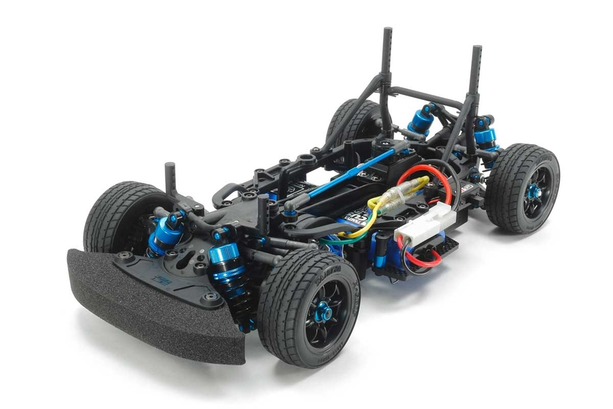
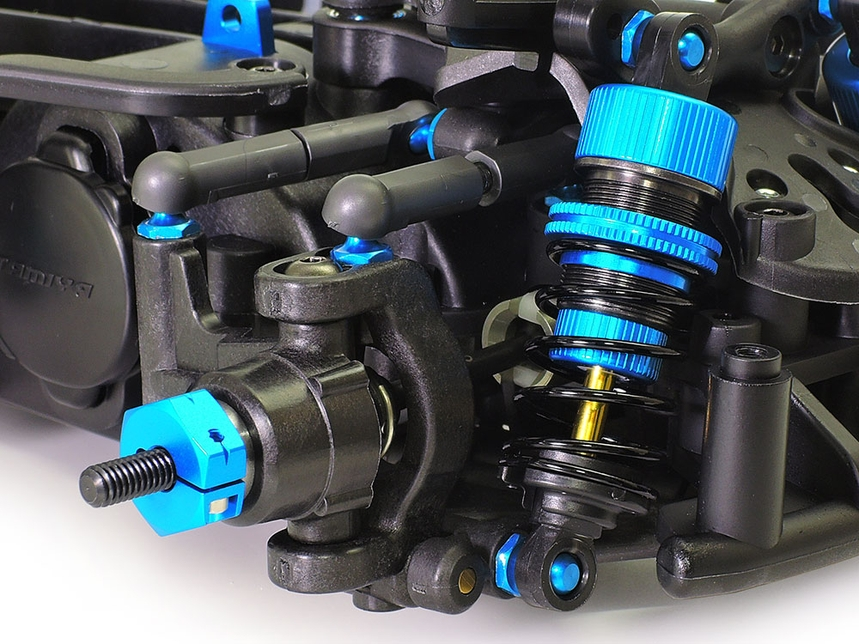
<figcaption>Figura 7: Chasis y Sistema de suspensión de Tamiya M-07R en escala 1:10</figcaption>
</figure>

Para resolver el problema, se diseñó y fabricó una estructura personalizada que se monta sobre el chasis Tamiya.

- **Diseño CAD**: Las piezas fueron modeladas en 3D utilizando el software Solid Edge, asegurando el ajuste preciso de la NVIDIA Jetson, las baterías y los drivers.
- **Material y Fabricación**: Se utilizó MDF (Fibrofácil) de 3mm cortado mediante tecnología láser. Se optó por MDF por su bajo costo, rapidez de prototipado y facilidad para realizar modificaciones in-situ (perforaciones adicionales) en comparación con la impresión 3D de piezas planas grandes. Además, el largo de la impresión no era soportado por las impresoras de la Universidad Austral.

<figure markdown="span">
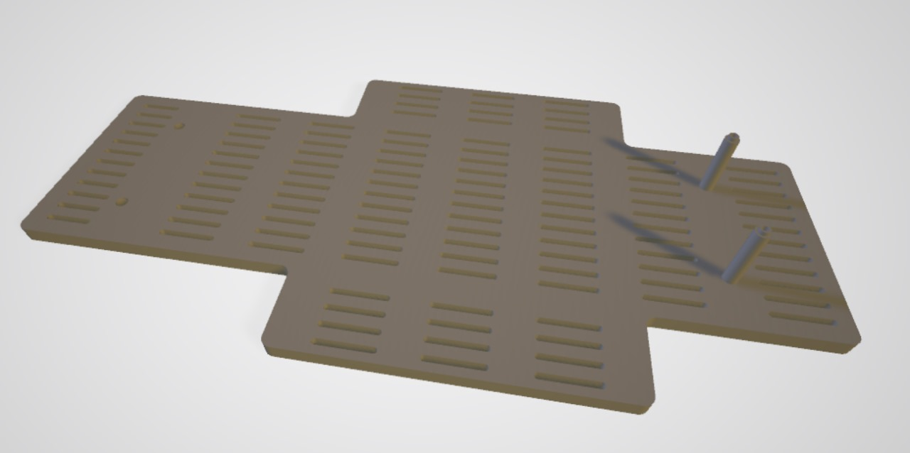
<figcaption>Figura 8: Diseño MDF de la base</figcaption>
</figure>

<figure markdown="span">
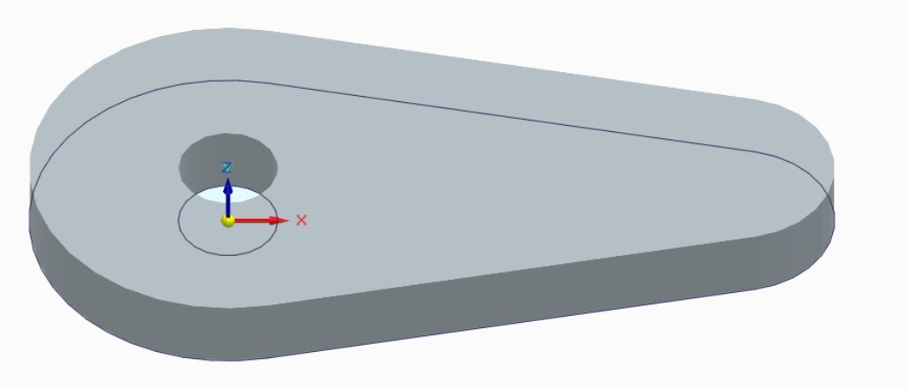
<figcaption>Figura 9: Diseño chaponete para fijar elementos</figcaption>
</figure>

- **Montaje de Sensores**: La estructura incluye un soporte frontal para la cámara USB. Si bien el montaje es fijo al chasis para evitar vibraciones, el diseño permite ajustar el ángulo de inclinación (tilt) de la cámara, lo cual es crítico para calibrar la transformación de perspectiva (Bird's Eye View) en el software.

<figure markdown="span">
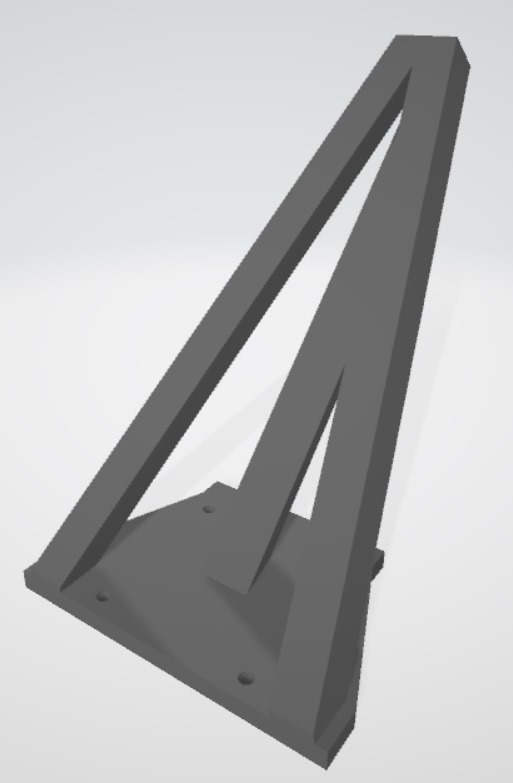
<figcaption>Figura 10: Estructura de soporte de la cámara</figcaption>
</figure>

## Selección de Componentes Electrónicos Clave

La lista de materiales se definió priorizando el rendimiento computacional y la compatibilidad con los estándares del BFMC. Los componentes principales son:

- **Unidad de Procesamiento Principal**: NVIDIA Jetson Orin Nano. Encargada del procesamiento de imágenes y la lógica de navegación de alto nivel en el entorno.

    <figure>

    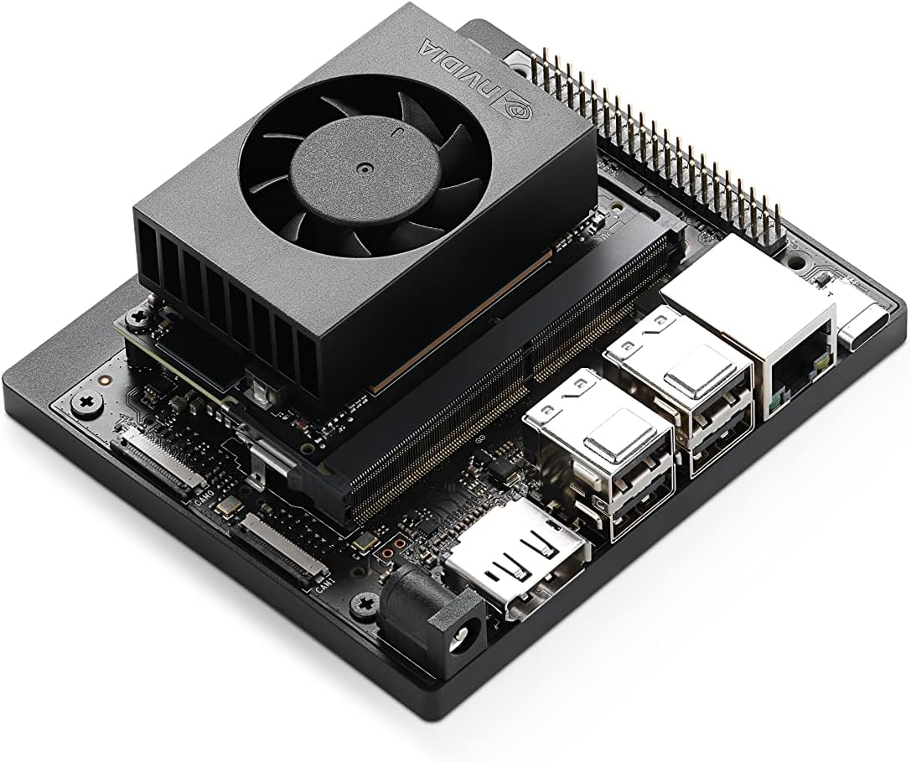

    <figcaption>Figura 11: NVIDIA Jetson Orín Nano Developer Kit</figcaption>

    </figure>

- **Microcontrolador de Bajo Nivel**: ESP32. Actúa como interfaz entre la Jetson y los actuadores físicos. Recibe comandos de velocidad y dirección vía Serial y genera las señales PWM correspondientes.

    <figure>

    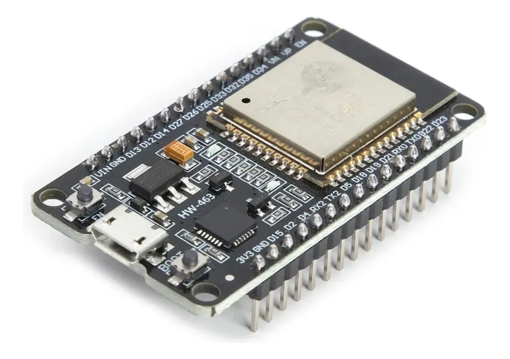

    <figcaption>Figura 12: ESP 32</figcaption>

    </figure>

- **Actuadores**:
    - Motor de tracción: Motor DC con escobillas (brushed) incluido en el kit Tamiya.

        <figure>

        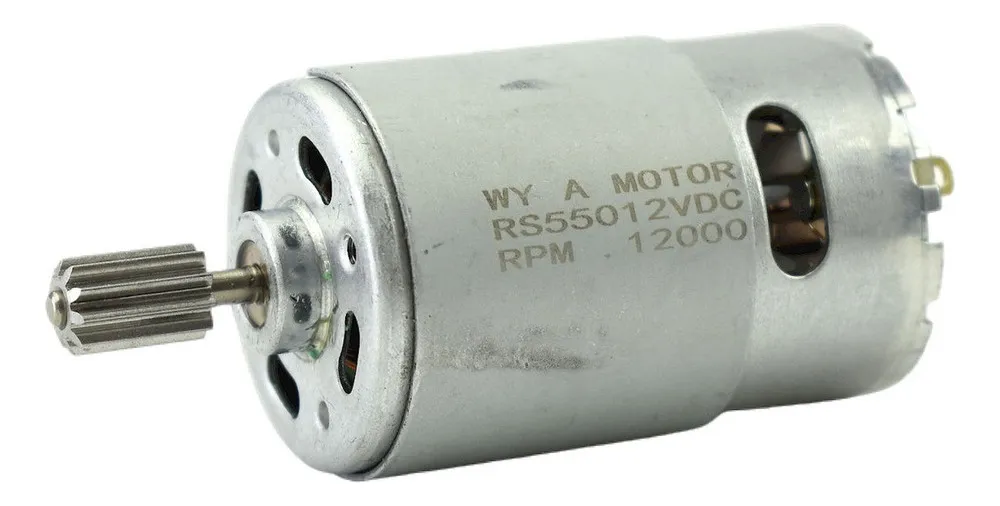

        <figcaption>Figura 13: Motor de tracción</figcaption>

        </figure>

    - Servo de Dirección: Servomotor estándar HRC 8.

        <figure>

        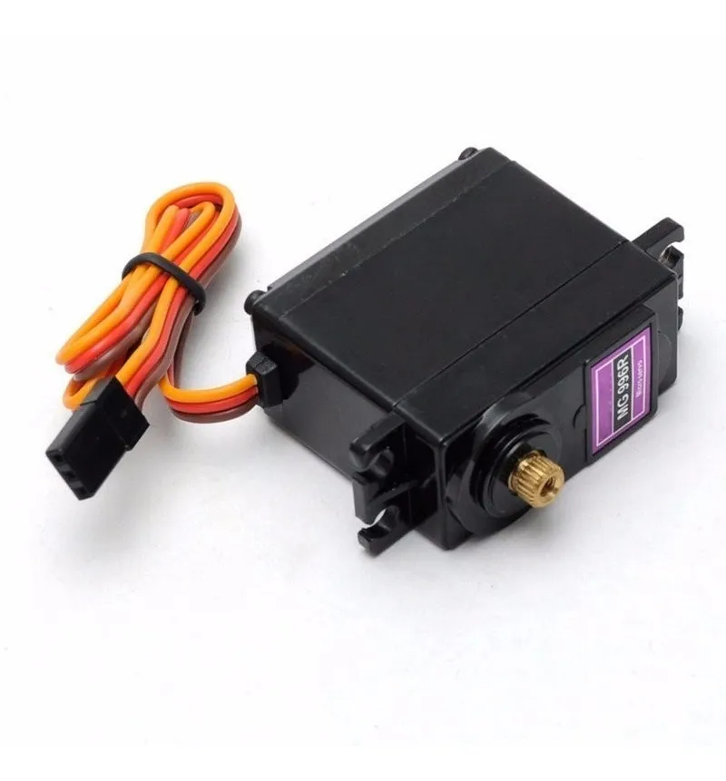

        <figcaption>Figura 14: Servomotor</figcaption>

        </figure>

- **Sensores**:
    - Sensor Ultrasonido Hc-sr04 utilizado en el frente del vehículo

        <figure>

        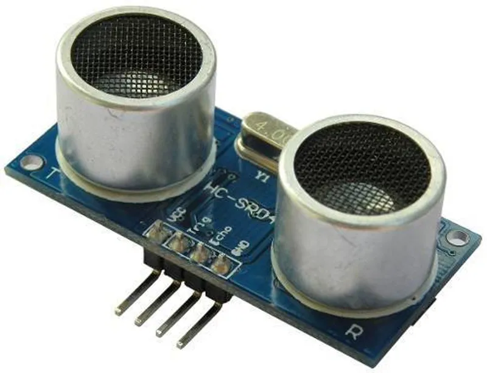

        <figcaption>Figura 15: Sensor Ultrasonido Hc-sr04</figcaption>

        </figure>

    - Cámara: Intel RealSense D435i con sensor de profundidad

<figure markdown="span">
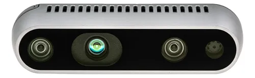
<figcaption>Figura 16: Intel RealSense D435i</figcaption>
</figure>

## Arquitectura de Alimentación:

Uno de los desafíos técnicos más críticos fue garantizar una alimentación estable. Los motores DC generan ruido eléctrico significativo que puede provocar reinicios en microcontroladores sensibles (como el ESP32) o caídas de tensión en la computadora principal. Además, la Jetson Orin Nano requiere un protocolo de alimentación de alta potencia (Power Delivery - PD).

Para solucionar esto, se implementó una arquitectura de alimentación segregada, separando físicamente el circuito de lógica del circuito de potencia:

**Circuito A: Lógica y Cómputo (Alta Estabilidad)**

- Fuente: Powerbank Xiaomi de 20000mAh con salida USB-C Power Delivery (PD) de hasta 50W.

    <figure>

    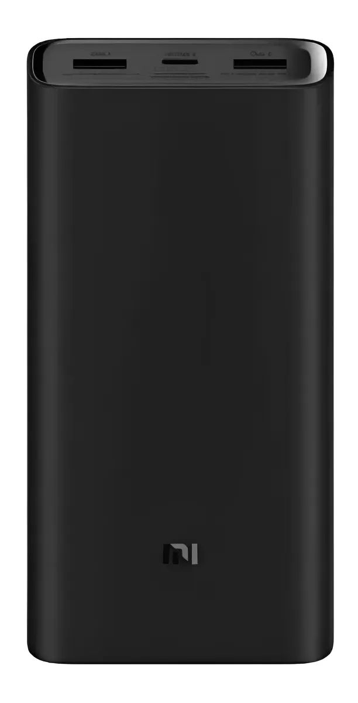

    <figcaption>Figura 17: Xiaomi Mi Power Bank</figcaption>

    </figure>

- Flujo: El Powerbank entrega el voltaje necesario mediante un cable PD con la NVIDIA Jetson Orin Nano (necesario 15V/3A). A su vez, la Jetson alimenta al ESP32 a través del cable de datos Micro-USB (5V).

    <figure>

    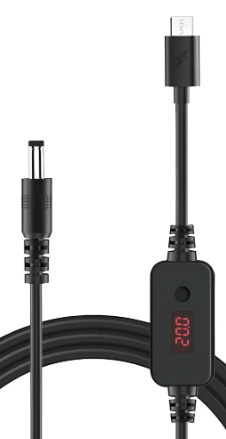

    <figcaption>Figura 18: Cable PD Usb-c a tipo barril</figcaption>

    </figure>

- *Ventaja:* Esto aísla la electrónica sensible de los picos de corriente generados por el motor.
**Circuito B: Actuadores (Alta Corriente)**

- Fuente: Batería LiPo de 7.4V (2 Celdas - 2S), 1500mAh.

    <figure>

    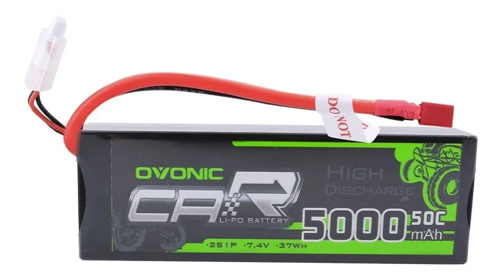

    <figcaption>Figura 19: Bateria LiPo Ovonic</figcaption>

    </figure>

- Flujo: Esta batería alimenta directamente los elementos que demandan alta corriente: el Driver del motor (Puente H) y el Servomotor de dirección.

## Driver de Potencia y Actuación

Para el control del motor de corriente continua, se requiere un puente H que interprete las señales PWM de bajo voltaje del ESP32 y maneje la corriente de la batería LiPo hacia el motor. Para ello. Se seleccionó el Driver L298N, evaluando así también opciones como el módulo IBT\_2 (de alta potencia). Sin embargo, se seleccionó el módulo basado en el chip L298N.

Dado que el motor del kit Tamiya escala 1:10 no demanda corrientes excesivas (dentro de los 2A continuos que maneja el L298N sin sobrecalentamiento crítico). El L298N ofreció una solución compacta, económica y con una interfaz de control PWM dual más sencilla de integrar con el ESP32 en el espacio disponible.

<figure markdown="span">
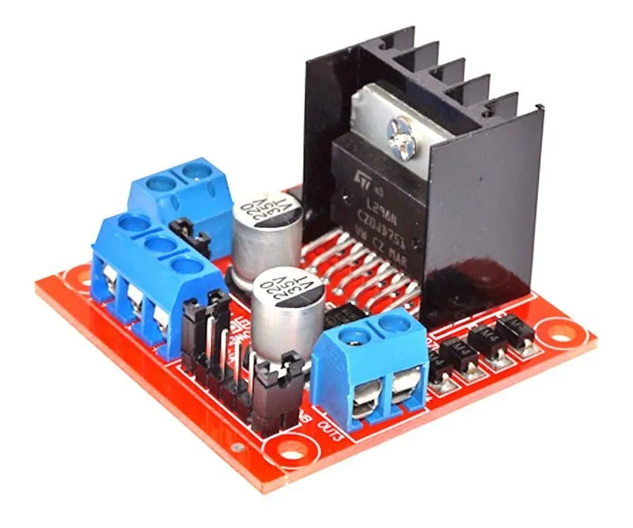
<figcaption>Figura 20: Módulo L298n Doble Puente H</figcaption>
</figure>
