# Implementación del Entorno de Validación

La validación de sistemas autónomos requiere reducir al mínimo la brecha entre la simulación y la realidad. Por ello, la construcción del entorno físico no se limitó a una representación estética, sino que se abordó como la implementación de un instrumento de calibración riguroso. El objetivo fue replicar fielmente las condiciones lumínicas, dimensionales y espaciales estipuladas por el reglamento oficial del *Bosch Future Mobility Challenge*, garantizando que los algoritmos desarrollados en el laboratorio sean directamente transferibles a la pista de competencia en Rumania.

## Selección de Superficie y Materiales

Uno de los problemas recurrentes durante las primeras etapas de testing fue la inestabilidad en la detección de carriles debido a la iluminación. Las superficies plásticas convencionales o los pisos encerados generaban reflejos especulares (brillos) bajo la luz cenital del laboratorio, lo que saturaba el sensor de la cámara y provocaba "falsos positivos" en la segmentación por color (espacio HSV), haciendo que el vehículo perdiera la trayectoria.

<figure markdown="span">
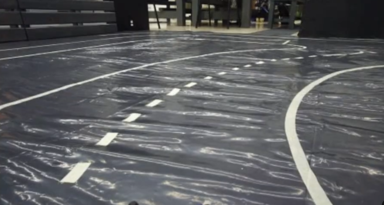
<figcaption>Figura 31: Pista de nylon con reflejos</figcaption>
</figure>

Para mitigar esto, se realizó una investigación de mercado y pruebas de materiales textiles, evaluando costos y propiedades ópticas. Se descartaron opciones como:

- Lonas Vinílicas impresas: Aunque ofrecían precisión gráfica, su costo era elevado y su superficie tendía a ser un poco más brillante.

    <figure>

    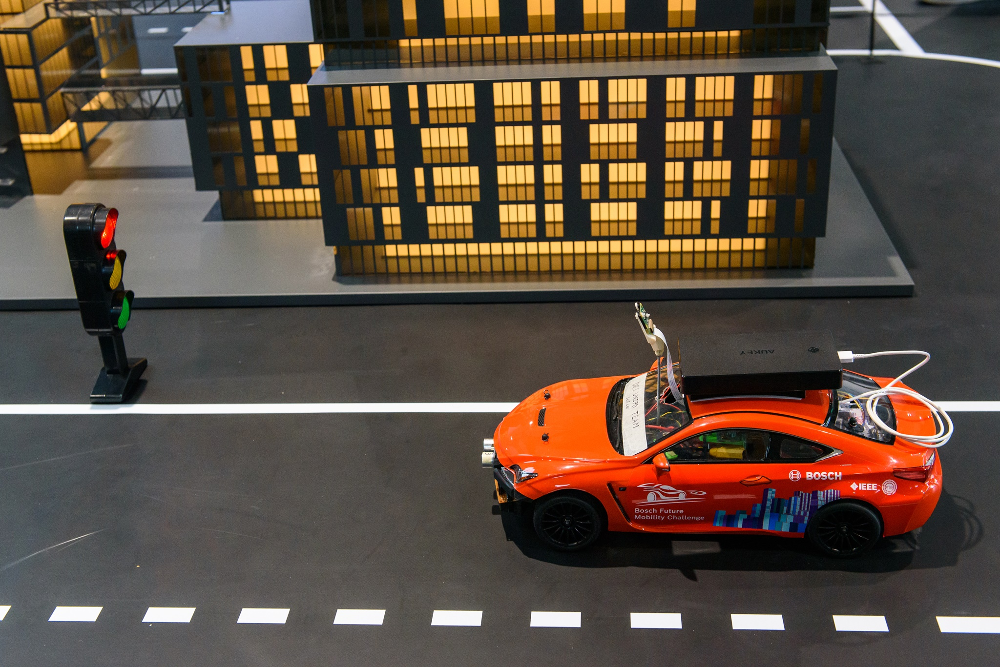

    <figcaption>Figura 32: Pista BFMC</figcaption>

    </figure>

- Tafeta y Acetatos: Descartados por ser demasiado delgados y propensos a arrugas que deforman la geometría de la pista.
- Placas de madera pintadas: Descartadas por problemas de almacenamiento y falta de portabilidad.

<figure markdown="span">
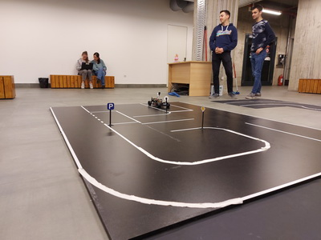
<figcaption>Figura 33: Pistera rigida en placa de madera</figcaption>
</figure>

La solucion implementada fue utilizar Tela Bagún, seleccionada de color negro mate. Esta elección técnica se fundamentó en tres pilares:

- Propiedad Antireflectiva: Su trama opaca absorbe la luz incidente, maximizando el contraste con la cinta blanca y estabilizando el algoritmo de visión artificial.
- Portabilidad y Logística: Al no contar con un espacio fijo permanente, la capacidad de la lona para ser enrollada sin deformarse permite montar y desmontar el circuito en minutos, optimizando el uso del espacio en el laboratorio.
- Costo-Efectividad: La confección manual (tela + cinta) resulta costar menos que una impresión en gran formato.

<figure markdown="span">
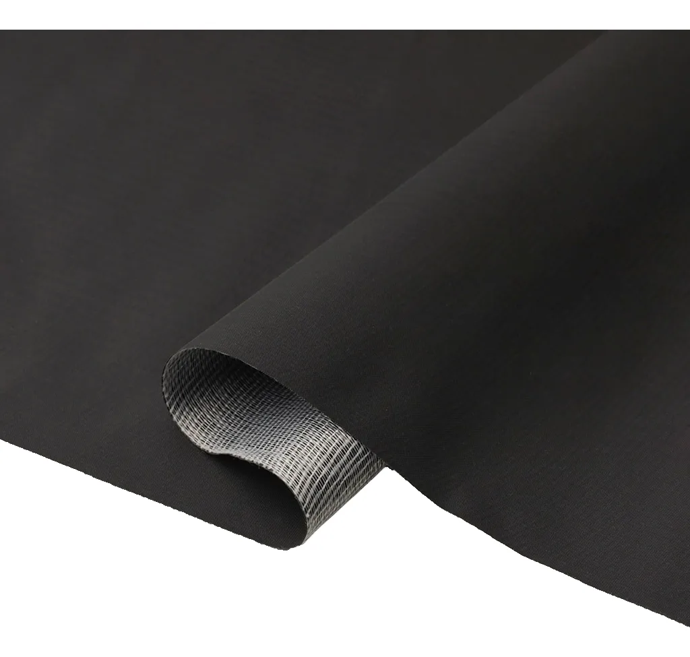
<figcaption>Figura 34: Tela Bagun Negro</figcaption>
</figure>

<figure markdown="span">
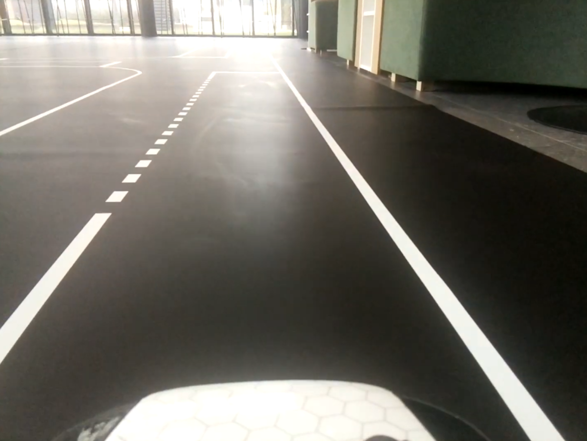
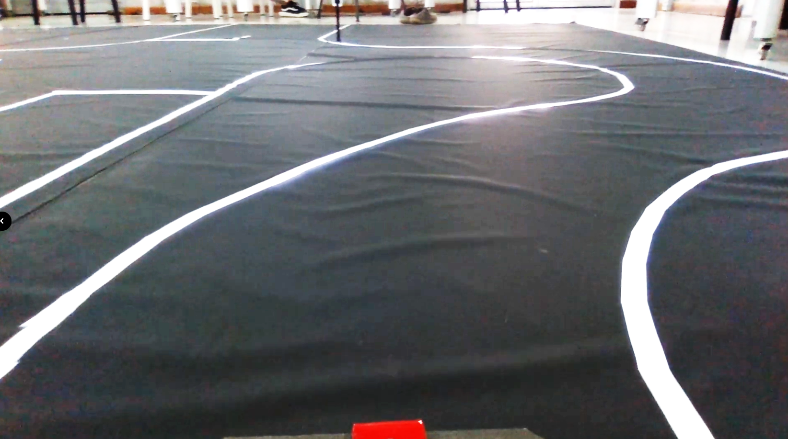
<figcaption>Figura 35: Pista en BFMC en comparación con pista elaborada en condiciones de alta luminosidad</figcaption>
</figure>

<figure markdown="span">
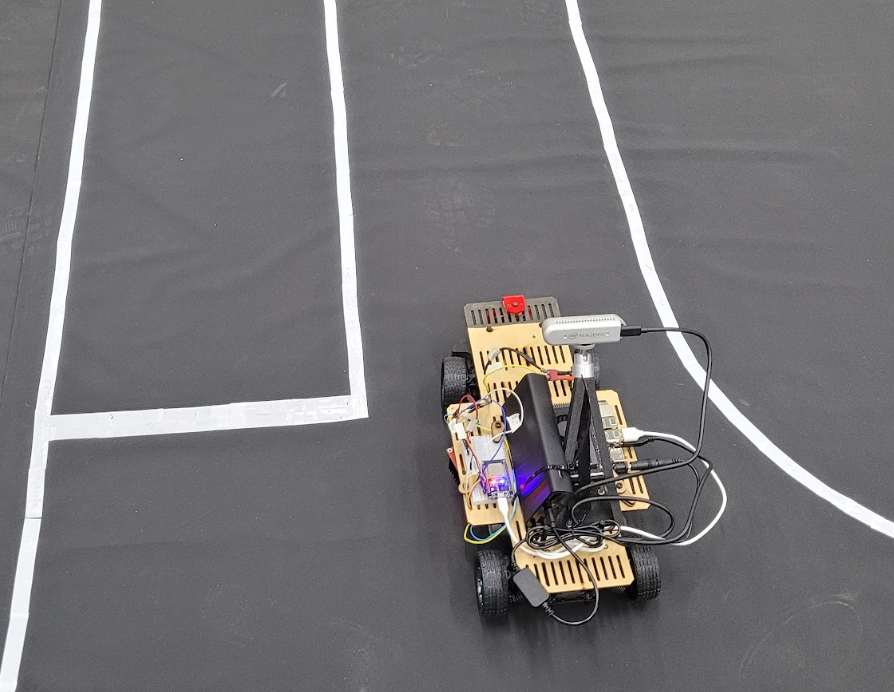
<figcaption>Figura 36: Ejemplo de pista con lona de tela bagun</figcaption>
</figure>

## Diseño Modular y Escalabilidad

La configuración espacial se logró mediante la unión de tres módulos de lona de 1.4 metros de ancho por 6 metros de largo cada uno. Esta arquitectura modular ofrece una ventaja estratégica sobre un diseño fijo: la escalabilidad. El uso de cinta aislante sobre la lona permite modificar el trazado a futuro, cambiar curvas por rectas o incluso acoplar más módulos para replicar el circuito completo del BFMC, tal como lo sugiere la organización de la competencia. Esta medida resultó ser utilizada también en la competencia a la hora de corregir o mejorar la trazada del recorrido. Si observamos con detenimiento en la imagen, el estacionamiento se reforzó con un material similar a una cinta aislante blanca utilizada por nosotros.

<figure markdown="span">
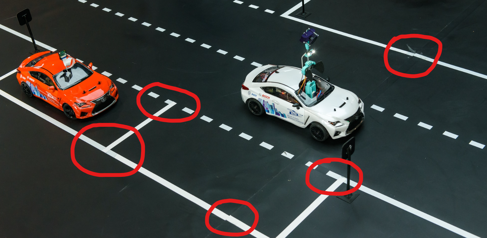
<figcaption>Figura 37: Pista BFMC</figcaption>
</figure>

## Estandarización de la Demarcación Vial

La aplicación de las líneas se realizó con cinta de vinilo blanca de alta adherencia, diferenciando estrictamente dos tipologías de vía según la normativa para someter al vehículo a distintos escenarios de control.

<figure markdown="span">
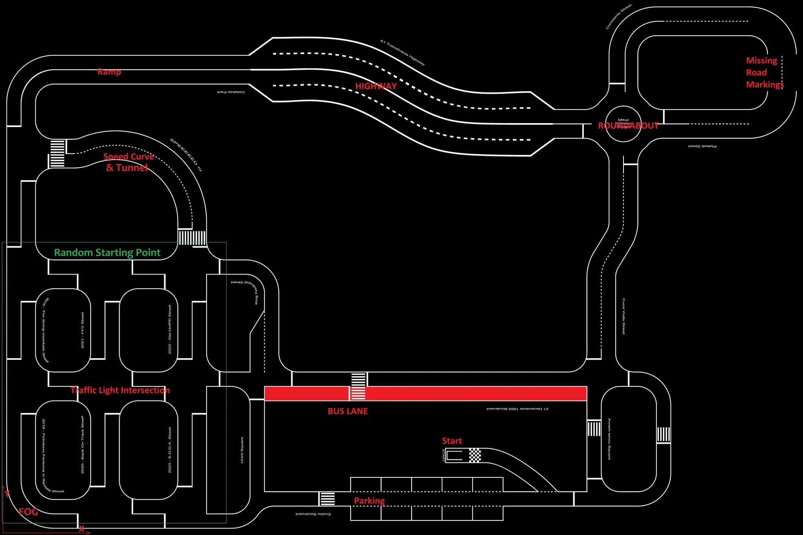
<figcaption>Figura 38: Pista entera en BFMC 2025</figcaption>
</figure>

<figure markdown="span">
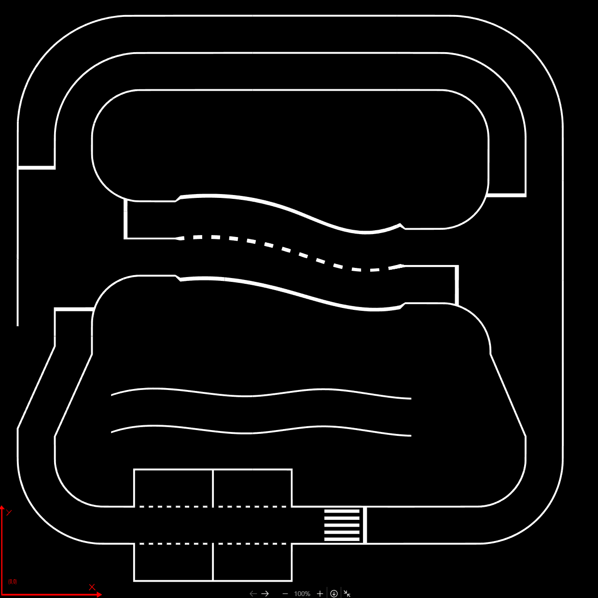
<figcaption>Figura 39: Pista de prueba sugerida por BFMC 2025</figcaption>
</figure>

**A. Zona Urbana (Urban Zone)** Configurada para maniobras de precisión.

- **Ancho de Carril:** 35 cm (medido desde bordes internos).
- **Líneas:** Espesor de 2 cm.
- **Desafío Técnico:** El patrón de línea discontinua central presenta una alta frecuencia (segmentos de 4.5 cm de trazo y 4.5 cm de espacio). Esta configuración exige que el algoritmo de ventanas deslizantes tenga una alta tasa de refresco para no "perder" la referencia de la curva en los espacios vacíos.

<figure markdown="span">
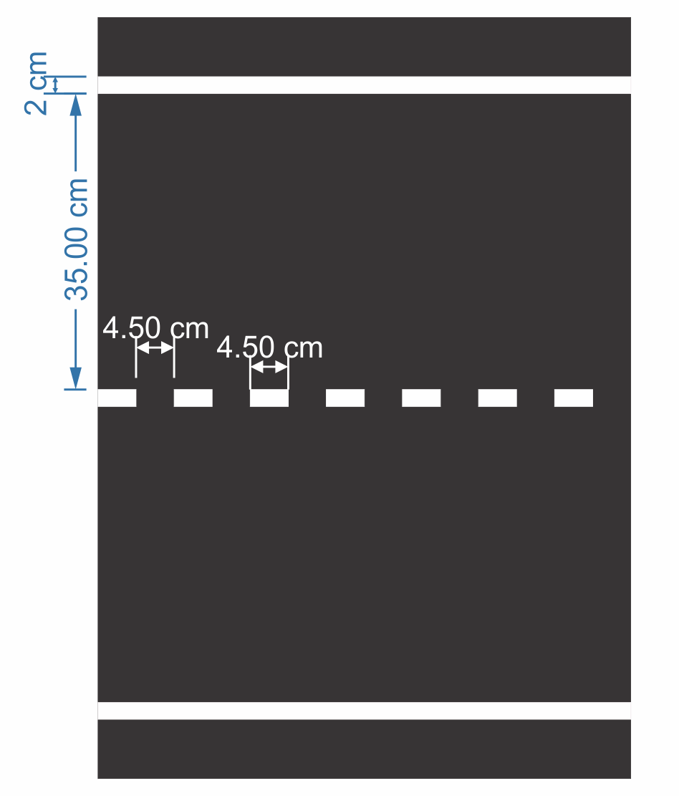
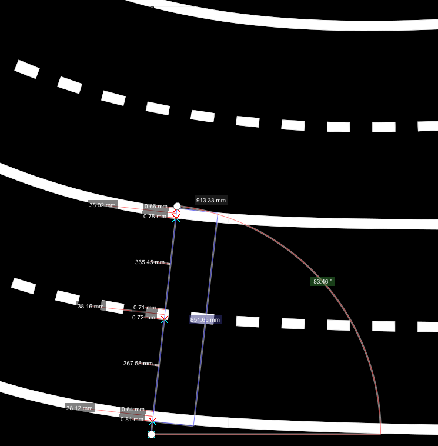
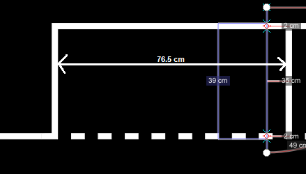
<figcaption>Figura 40: Marcas viales por BFMC</figcaption>
</figure>

<figure markdown="span">
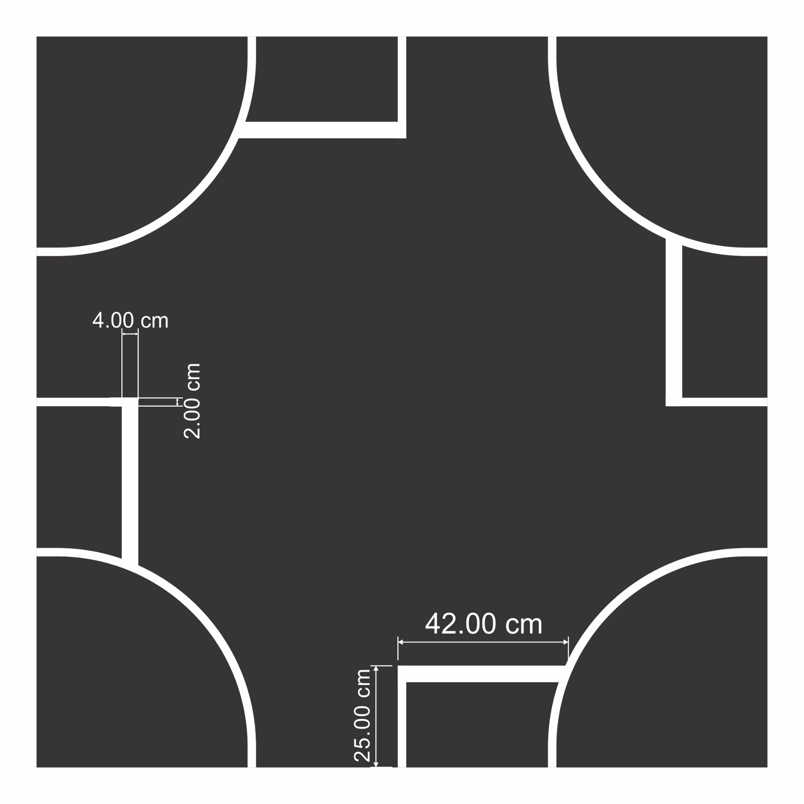
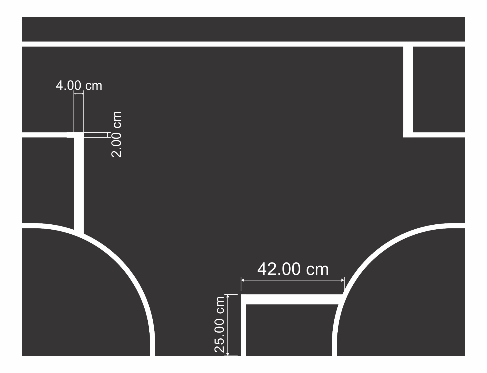
<figcaption>Figura 41: Marcas viales por BFMC</figcaption>
</figure>

**B. Zona de Autopista (Highway)** Diseñada para validar la estabilidad longitudinal.

- **Ancho de Carril:** 37 cm.
- **Líneas:** Espesor robusto de 4 cm.
- **Desafío Técnico:** El patrón discontinuo es más espaciado (**9 cm de trazo y 9 cm de vacío**), permitiendo al sistema de visión proyectar una *lookahead** distancia* más lejana para anticipar la trayectoria.
Para la validación integral del sistema autónomo, no basta con segmentos rectos aislados. Se diseñó y construyó un trazado complejo que integra los desafíos de navegación lógica descritos en el reglamento. La Figura a continuación presenta el plano CAD utilizado para la confección de la pista en la Universidad.

<figure markdown="span">
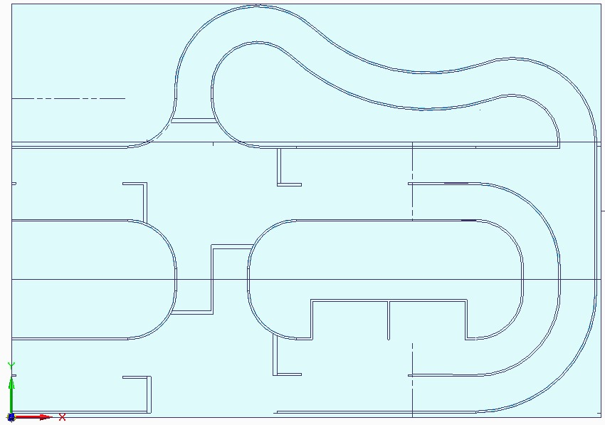
<figcaption>Figura 42: Pista de elaboración propia</figcaption>
</figure>

El *layout* propuesto se caracteriza por una topología híbrida que permite testear diferentes estados de la máquina de estados finitos del robot:

- **Curvas Compuestas:** En la sección superior del plano se observa una sucesión de curvas en "S" (chicanas) con radios de curvatura variables. Este sector es crítico para calibrar el controlador PID de la dirección, forzando al vehículo a calcular el error lateral (*cross-track error*) de manera continua sin oscilaciones excesivas.
- **Intersecciones y cruces:** El diseño incorpora intersecciones en "T" y cruces de cuatro vías. Estas zonas son fundamentales para validar la integración entre la detección de carriles (que debe interrumpirse o predecirse al cruzar la bocacalle) y la detección de objetos (semáforos y señales de *Stop*).

<figure markdown="span">
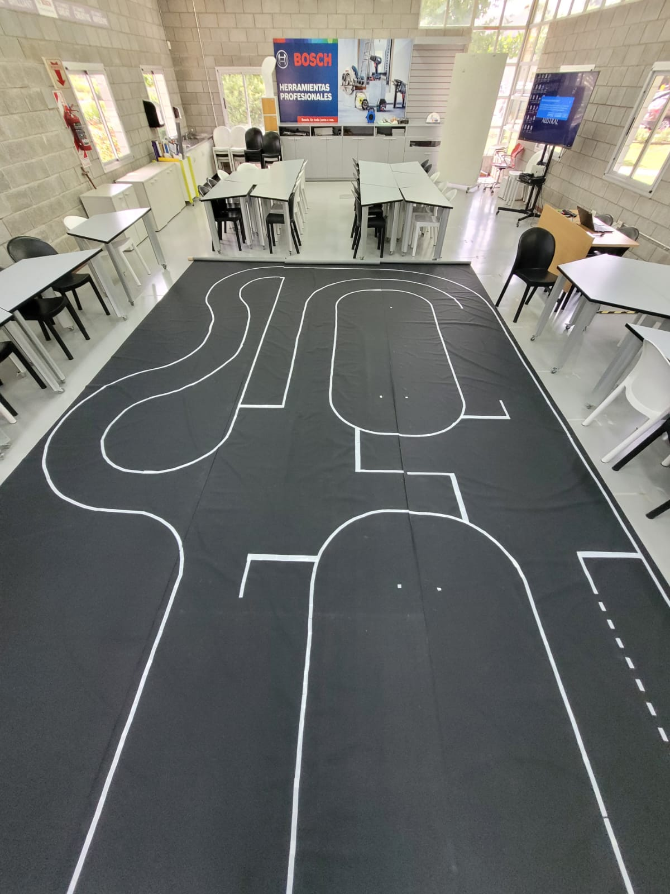
<figcaption>Figura 43: Pista de elaboración propia en prueba</figcaption>
</figure>

## Señalización y elementos del entorno

Para dotar al entorno de complejidad semántica, se fabricó un conjunto completo de señales de tráfico siguiendo los archivos vectoriales oficiales de la competencia. El set incluye señales de *Stop, Parking, Priority, Crosswalk*, así como indicaciones de dirección y restricciones de acceso.

<figure markdown="span">
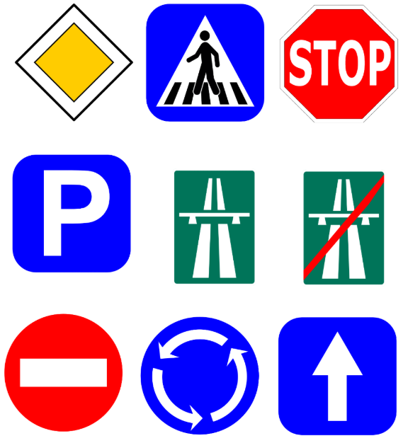
<figcaption>Figura 44: Señalización</figcaption>
</figure>

La materialización de estos elementos requirió un proceso de manufactura híbrido. Los gráficos fueron impresos en alta resolución y montados sobre soportes rígidos de 6x6 cm. Para la estructura vertical, se utilizaron los modelos 3D oficiales de los pilares y bases, los cuales fueron fabricados mediante impresión 3D en ácido poliláctico (PLA). Esta construcción garantiza que el centro geométrico de la señal se ubique a una altura estandarizada de aproximadamente 20 cm del suelo. Esta cota no es arbitraria; está calculada para alinearse con el campo de visión (FOV) vertical de la cámara montada en el chasis, maximizando la probabilidad de detección por la red neuronal YOLOv8 a distancias medias.

<figure markdown="span">
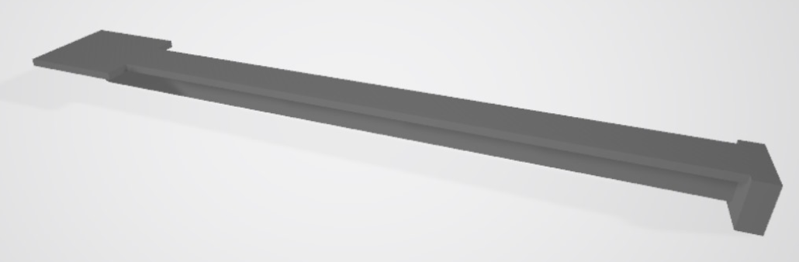
<figcaption>Figura 45: Diseño 3D de señalización</figcaption>
</figure>

La ubicación de cada señal en la pista sigue una lógica funcional estricta, colocándose como referencia directa al objeto que regulan (por ejemplo, la señal de *Stop* adyacente a la línea de detención de la intersección). Esto permite validar la lógica de control del vehículo, que debe asociar la detección de la *Bounding Box* con una acción inmediata en los actuadores.

<figure markdown="span">
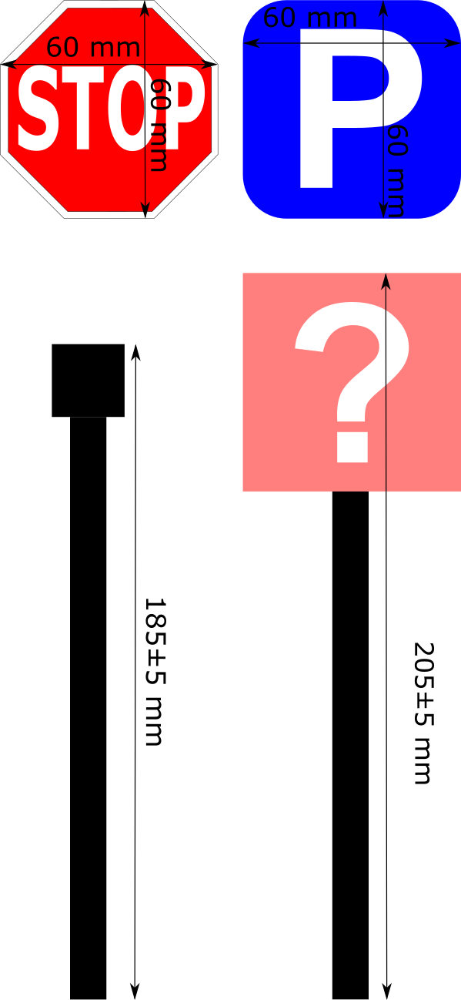
<figcaption>Figura 46: Cotas de la señal</figcaption>
</figure>

## Infraestructura de Intersecciones y Conectividad

Las intersecciones reguladas representan los puntos de mayor complejidad lógica del circuito. Para simularlas, se integraron réplicas funcionales de semáforos con luces led, capaces de replicar la secuencia de estados estándar (Rojo, Amarillo, Verde).

<figure markdown="span">
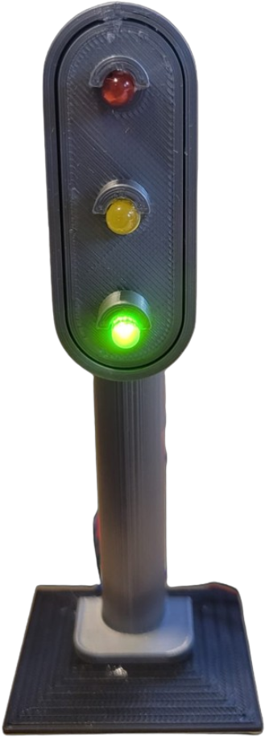
<figcaption>Figura 47: Semáforo impreso 3D con luces led y ESP32</figcaption>
</figure>

Más allá de su función visual, estos dispositivos dotan a la pista de capacidades de "Ciudad Inteligente". Aunque el enfoque principal de esta tesis se centra en la navegación basada puramente en visión (Vision-Only), la infraestructura instalada posee la capacidad de transmitir su estado mediante el protocolo de comunicación UDP a través de Wi-Fi. Esto deja el entorno de validación preparado para futuras investigaciones en tecnologías V2X (Vehicle-to-Everything), donde el vehículo podría recibir el estado del semáforo de manera inalámbrica antes de tener contacto visual, una característica exigida en las etapas avanzadas del BFMC.
