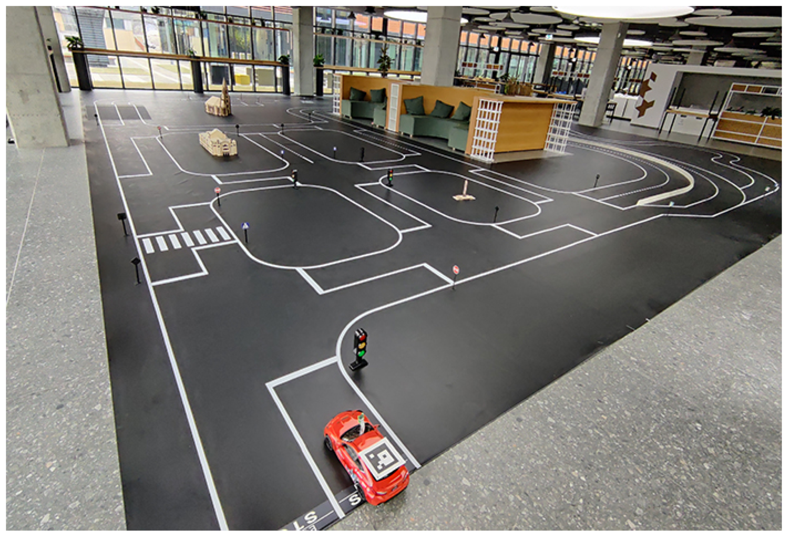
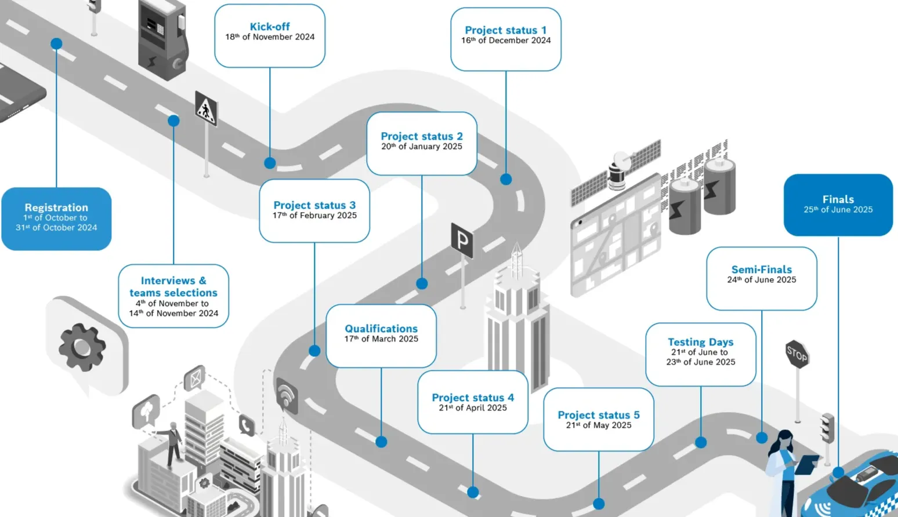
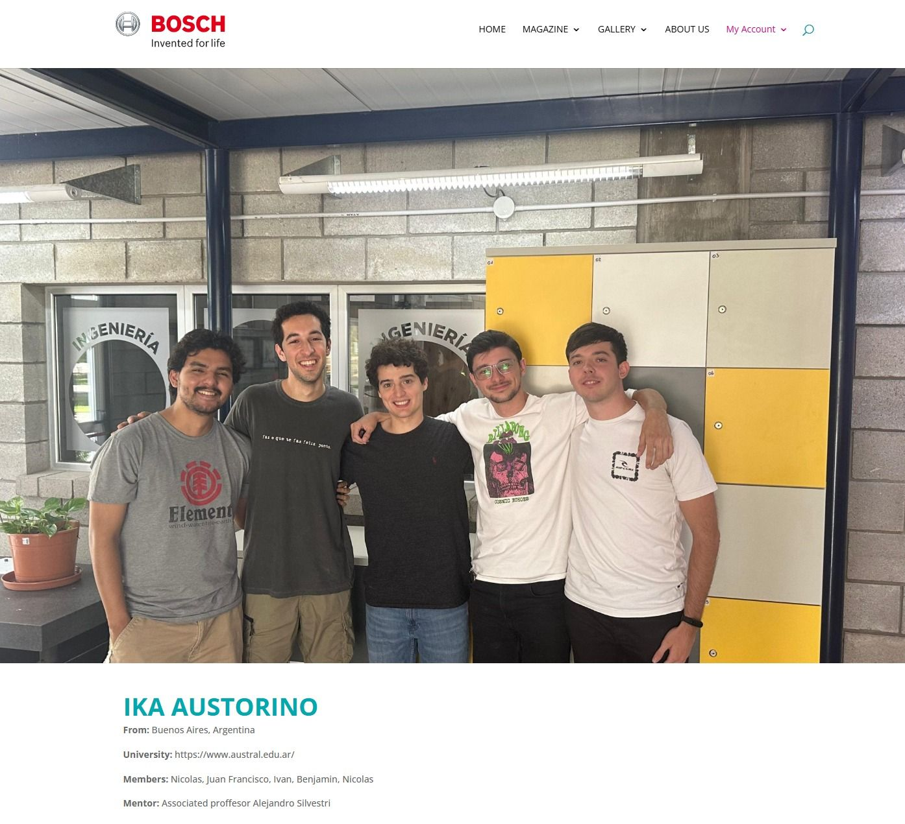
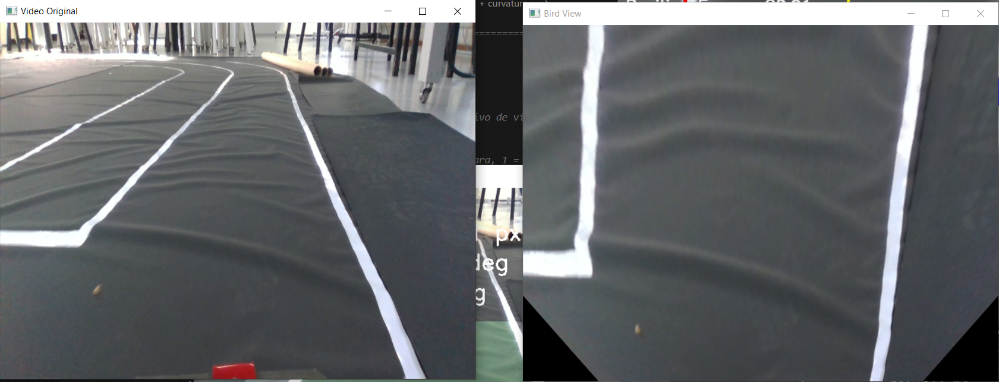
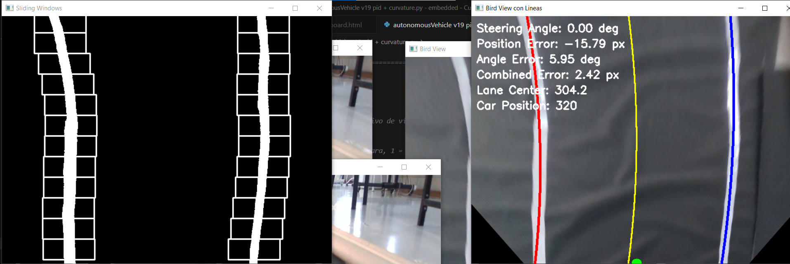
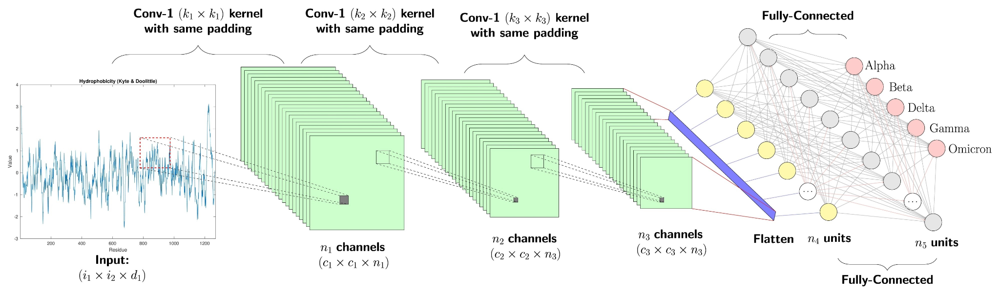

# Marco Teórico

## La Competencia Bosch Future Mobility Challenge (BFMC).

El Bosch Future Mobility Challenge es una competencia internacional técnica de conducción autónoma y conectividad, organizada por Bosch Engineering Center en Cluj-Napoca, Rumania, desde 2017. Invita a equipos de estudiantes a desarrollar algoritmos de conducción autónoma y conectividad en vehículos a escala 1:10. El entorno de la competencia simula una "Smart City" en miniatura, con calles delineadas, intersecciones, señales de tráfico estáticas y dinámicas (semáforos), y obstáculos.

Durante la competencia, los equipos están obligados a realizar evaluaciones mensuales de su avance, elaborar informes técnicos y cargar sus progresos en un repositorio de la plataforma de GitHub. Además, deben presentar su trabajo frente a un jurado internacional, el cual se encargará de otorgar premios a los desempeños más destacados.

Los equipos deben afrontar una variedad de desafíos técnicos, como crear algoritmos sólidos para reconocer señales de tráfico, gestionar la navegación en intersecciones y coordinar la interacción con otros vehículos y peatones. El propósito es que los participantes desarrollen una solución autónoma integral, capaz de manejar todas estas variables dentro de un entorno simulado y empleando vehículos a escala reducida.

Las normas de la competencia imponen limitaciones que influyen directamente en el diseño del vehículo. A continuación, se mencionan algunas de las restricciones que deben cumplirse:

- **Sensores Permitidos**: Se prioriza el uso de cámaras y sensores de proximidad, inerciales (IMU), aunque algunos equipos integran LiDAR. La competencia penaliza el daño a la infraestructura, lo que obliga a sistemas de evasión robustos.
- **Navegación**: El vehículo debe ser capaz de mantenerse en el carril ("Lane Keeping") y obedecer las leyes de tránsito (Stop, Ceda el Paso, Semáforos) sin intervención humana.
- **Restricciones Físicas**: El vehículo debe caber dentro de un carril estándar de la competencia y debe ser capaz de maniobrar en curvas cerradas.

<figure markdown="span">

<figcaption>Figura 1: Pista de Bosch Engineering Center en Cluj-Napoca, Rumania</figcaption>
</figure>

### Historia del BFMC

El Bosch Future Mobility Challenge nació en 2017, creado por el Bosch Engineering Center en Cluj-Napoca, Rumania, con el propósito de impulsar el interés de estudiantes universitarios en la ingeniería aplicada a la autonomía vehicular. Desde su creación, el evento se lleva a cabo cada año, ofreciendo a los participantes la oportunidad de colaborar con especialistas de la industria y docentes universitarios, mientras desarrollan propuestas innovadoras relacionadas con la movilidad autónoma.

### Team IKA Austorino

La participación del Team IKA Austorino en el Bosch Future Mobility Challenge se inició a finales de 2024, cuando el profesor Alejandro Silvestri acercó a un grupo de estudiantes la oportunidad de formar parte de la competencia. Esta oportunidad fue principalmente dada a otro equipo de alumnos a finales de 2023, quienes lograron participar de la misma competencia, llegando a clasificar como primer grupo de la Universidad Austral.

Una vez completa la inscripción del nuevo equipo, este pasó por una entrevista preliminar, donde se identificó la necesidad de incorporar más miembros con experiencia en informática para fortalecer el proyecto en cuanto a la capacidad de redacción de código. El rendimiento en esa entrevista permitió que el equipo obtuviera su clasificación oficial. No obstante, el grupo no recibió el kit del vehículo proporcionado por la organización, por lo que las primeras fases de desarrollo y prueba debieron realizarse sin ese recurso.

<figure markdown="span">

<figcaption>Figura 2: Cronograma de la competencia.</figcaption>
</figure>

<figure markdown="span">

<figcaption>Figura 3: El equipo IKA AusTorino —Benjamin, Nicolas, Juan Francisco, Iván y Nicolas—.</figcaption>
</figure>

El nombre de grupo “IKA AusTorino” representa un homenaje a la historia automotriz argentina. El Torino, creado por Industrias Kaiser Argentina, se convirtió en un ícono nacional por su diseño, su impacto cultural y su vínculo con el automovilismo, especialmente por su histórico desempeño en Nürburgring. Elegir este nombre conecta al equipo con la industria local, la pasión deportiva y un legado reconocido dentro y fuera del país.

## Tecnologías de Conducción Autónoma

La Sociedad de Ingenieros de Automoción (SAE) define seis niveles de automatización para vehículos, desde el Nivel 0 (sin automatización) hasta el Nivel 5 (automatización completa). Los niveles se pueden definir como:

- **Niveles 0-2 (Asistencia)**: El conductor humano monitorea el entorno. El sistema ayuda con la dirección o la aceleración (ej. Control crucero adaptativo).
- **Niveles 3-5 (Automatización)**: El sistema monitorea el entorno. En el nivel 5, el volante es opcional.
El prototipo desarrollado en este trabajo se sitúa funcionalmente entre el Nivel 2 y el Nivel 3. El sistema es capaz de realizar el control lateral (dirección) y longitudinal (motor) basándose en la percepción del entorno (líneas de carril y señales), pero opera en un dominio de diseño operativo (ODD) restringido: la pista de laboratorio controlada.

Para la percepción, la industria utiliza una fusión de sensores: LiDAR (mapas 3D precisos), radar (velocidad y distancia) y cámaras (interpretación semántica). Este proyecto se centra en la Visión Artificial (cámara) como sensor primario, emulando el enfoque de "Vision-Only" utilizado por empresas como Tesla, que prioriza el procesamiento de imágenes mediante redes neuronales sobre el uso de sensores láser costosos.

## Plataformas de Procesamiento: NVIDIA Jetson vs. Raspberry Pi

La elección de la unidad de procesamiento central es la decisión de hardware crítica en robótica móvil. Se evaluaron dos arquitecturas predominantes en el ámbito educativo/prosumidor:

Por un lado, la Raspberry Pi (Arquitectura CPU): Basada en procesadores ARM Cortex. Si bien es eficiente para tareas de propósito general y control de bajo nivel, carece de aceleración de hardware dedicada para operaciones matriciales intensivas. En pruebas preliminares, la ejecución de modelos de detección de objetos (como YOLO) en la CPU de la Raspberry Pi resultó en una latencia elevada, lo que introduce un retraso no aceptable para la conducción autónoma en tiempo real.

Por el otro lado, la NVIDIA Jetson Orin Nano (Arquitectura GPU): Diseñada específicamente para "Edge AI". Integra una GPU basada en la arquitectura Ampere con núcleos CUDA y Tensor Cores. Esta arquitectura permite paralelizar masivamente las operaciones matemáticas requeridas por las redes neuronales convolucionales, reduciendo así dramáticamente la latencia.

Se seleccionó la NVIDIA Jetson Orin Nano debido a su capacidad para ejecutar inferencia de Inteligencia Artificial con aceleración por hardware (CUDA). Mientras que una CPU procesa las imágenes secuencialmente, la GPU de la Jetson permite procesar múltiples píxeles y filtros simultáneamente, garantizando una tasa de cuadros por segundo o *frames per second* (FPS) suficiente para que el vehículo reaccione a tiempo ante una curva o un obstáculo.

## Estrategias de Percepción Computacional en Visión Artificial

El sistema de percepción del vehículo se diseñó bajo una arquitectura híbrida, combinando técnicas de Visión Artificial Clásica para la navegación inmediata (carriles) y Deep Learning para la interpretación semántica del entorno (señales).

### Visión Artificial Clásica: Detección de Carriles

Para la detección de las líneas de la pista (carriles), se optó por algoritmos de procesamiento de imágenes basados en geometría y color, debido a su determinismo y menor carga computacional en comparación con las redes neuronales. La técnica central utilizada es la de Ventanas Deslizantes (Sliding Windows). Este método consiste en los siguientes fundamentos teóricos:

**Transformación de Perspectiva** (Bird's Eye View): Se aplica una matriz de homografía para transformar la imagen de la cámara frontal a una vista aérea, eliminando la distorsión de la perspectiva y haciendo que las líneas paralelas se vean efectivamente paralelas.

**Segmentación por Color y Bordes**: Se utilizan espacios de color (como HSV o HLS) para aislar el blanco de las líneas sobre el fondo negro de la lona, generando una máscara binaria.

**Histogramas y Ventanas**: Se calcula un histograma de la mitad inferior de la imagen para encontrar los picos de intensidad (donde empiezan las líneas). A partir de esos picos, se colocan ventanas rectangulares que "suben" por la imagen siguiendo la curvatura de los píxeles activos.

**Ajuste Polinomial**: Una vez identificados los píxeles de cada carril, se ajusta un polinomio de segundo grado que describe matemáticamente la curvatura de la carretera.

<figure markdown="span">

<figcaption>Figura 4: Preprocesamiento de la detección de carriles</figcaption>
</figure>

<figure markdown="span">

<figcaption>Figura 5: Determinación del desplazamiento del vehículo</figcaption>
</figure>

### Aprendizaje Profundo: Redes Neuronales (YOLO)

Para la detección de objetos complejos cuya geometría varía según el ángulo y la distancia (señales de "Stop", "Parking", semáforos, entre otros), los métodos clásicos son insuficientes. Para ello se implementó YOLO v8 (You Only Look Once).

<figure markdown="span">

<figcaption>Figura 6: Redes neuronales convolucionales (CNN). Figura 3 de Matsuzka y Iyoda (2026), <em>Frontiers in Radiology</em>, <a href="https://doi.org/10.3389/fradi.2025.1733003">doi:10.3389/fradi.2025.1733003</a>, reproducida bajo licencia CC BY 4.0.</figcaption>
</figure>

YOLO trata la detección de objetos como un problema de regresión único. La red "mira" la imagen completa una sola vez y predice simultáneamente las cajas delimitadoras (bounding boxes) y las probabilidades de clase para todos los objetos. Ventajas para el proyecto:

**Velocidad**: Al ser una red de una sola etapa ("one-stage detector"), es extremadamente rápida, ideal para el hardware embebido de la Jetson.

**Generalización**: YOLO aprende representaciones generalizables de los objetos, lo que lo hace robusto ante cambios de iluminación en el laboratorio.

**Implementación**: Se utilizó la librería ultralytics, que facilita el entrenamiento con datasets personalizados y la exportación del modelo en formato .pt (PyTorch) optimizado para su ejecución en el entorno de la Jetson.
