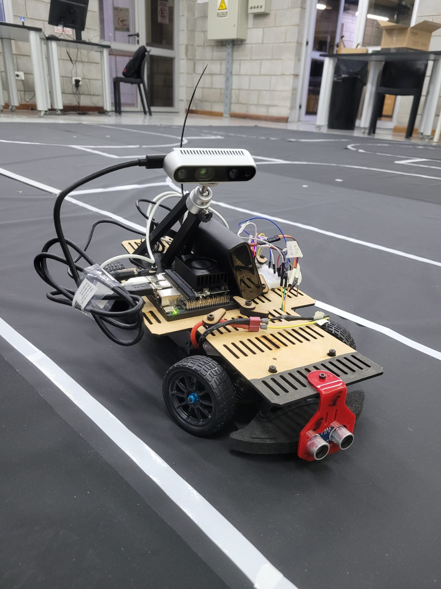

# Robot Autónomo de Laboratorio - BFMC

<figure markdown="span">

<figcaption>Raúl, el vehículo desarrollado para la Bosch Future Mobility Challenge.</figcaption>
</figure>

Trabajo de grado de Ingeniería Industrial e Informática

**Alumnos de Ingeniería Industrial: **Nicolas Visintin y Juan Francisco Pittaro

**Alumnos de Ingeniería Informática: **Nicolas Mangini e Iván Ostrowski

**Tutor de Trabajo de grado:** Alejandro Silvestri

Trabajo final de grado de las carreras:

- Ingeniería Industrial (Orientación Mecatrónica)
- Ingeniería Informática
