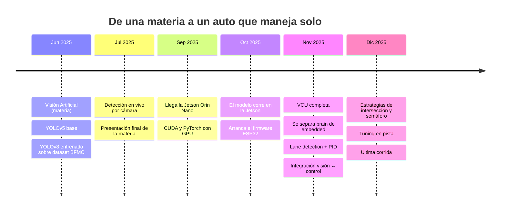

# Cómo llegamos acá

Esta página es la bitácora del proyecto: no *qué* construimos —eso está en
[Arquitectura](arquitectura/index.md)— sino **en qué orden y por qué**.

Cada etapa está fechada y enlaza al trabajo que la respalda.

---

## Etapa 0 — El punto de partida

El primer desarrollo del subsistema de percepción se hizo en el marco de la materia
**Visión Artificial**, durante el primer cuatrimestre de 2025.

El trabajo consistía en entrenar un detector de objetos. Se eligió como dominio la
maqueta de la **Bosch Future Mobility Challenge (BFMC)** —señales de tránsito y
semáforos a escala—, aprovechando el interés del equipo por la competencia y la
disponibilidad del dataset en Roboflow.

!!! note "Una elección de dominio que dio continuidad"
    Trabajar directamente sobre el dominio BFMC permitió que ese primer detector se
    integrara después al vehículo sin reentrenamiento: el modelo desarrollado en la
    materia es el mismo que terminó corriendo a bordo. La elección de un dominio
    específico desde el inicio es lo que hizo posible esa continuidad.

## Etapa 1 — Junio 2025: del "hola mundo" al modelo propio

**6 de junio** — Arranca [`vision-artificial`](https://github.com/Robot-Autonomo-de-Laboratorio-BFMC/vision-artificial).
Empezamos deliberadamente por lo más simple: **YOLOv5 con pesos preentrenados**,
detectando personas sobre imágenes de prueba (`predict/prueba-yolov5-base/`). El
objetivo no era detectar nada útil, sino entender el flujo completo —inferencia,
salida, visualización— antes de meter datos propios.

**13 de junio** — Ya con YOLOv8 y dataset propio. Acá aparece la primera decisión
técnica de fondo: **fusionar dos datasets**, uno de semáforos y otro de señales
BFMC, reescalados y unificados en Roboflow.

Los resultados se documentaron en dos informes que sobreviven en la wiki:

- [Detección de semáforos](vision/informe-semaforos.md) — el dataset solo de luces.
  Muestra una curva de aprendizaje clásica: mAP@0.5 de **0.482 → 0.923 → 0.986**
  entre 1, 10 y 50 épocas.
- [Informe comparativo del dataset fusionado](vision/informe-comparativo.md) —
  el merge de semáforos + señales, que arrancó con **mAP@0.5 de 0.995 desde la
  primera época**.

!!! warning "Un resultado que nos hizo desconfiar"
    Que el dataset fusionado diera 0.995 de mAP en **una sola época** no es una
    buena noticia: es una señal de que el problema es demasiado fácil para el
    modelo. Las imágenes de maqueta son limpias, con fondo controlado y señales
    grandes y nítidas. La métrica era real, pero no predecía el rendimiento en
    pista —y efectivamente, los falsos positivos con luz ambiente exterior
    aparecieron después, ya con el auto andando.

## Etapa 2 — Julio 2025: de imágenes estáticas a cámara en vivo

**5 de julio** — Cierre de la materia. Pasamos de correr inferencia sobre archivos
a hacerlo sobre el stream de una webcam, y agregamos el camino de GPU.

Con eso se cerró la etapa cursada de la materia, y el subsistema de percepción
quedó listo para integrarse al vehículo.

## Etapa 3 — Septiembre 2025: el salto al hardware

Acá el proyecto cambia de naturaleza. Deja de ser un notebook y pasa a ser un
sistema embebido.

**15 y 24 de septiembre** — Llega la **NVIDIA Jetson Orin Nano** y empieza la pelea
real: habilitar CUDA, conseguir una compilación de PyTorch que efectivamente use la
GPU, y armar la imagen del sistema.

**29 de septiembre** — Primeras pruebas de contenedores sobre la Jetson.

!!! abstract "La bitácora de esta etapa está entera"
    Todo el proceso de puesta a punto de la Jetson quedó documentado paso a paso
    mientras pasaba: [Jetson Nano — de flash a success](archivo/notion/jetson/index.md).
    Incluye la elección de JetPack 6.1, el problema de `snap` que obligaba a
    recompilar el kernel (resuelto con Flatpak), el
    [autostart con systemd](archivo/notion/jetson/autostart-de-aplicaciones-en-jetson-usando-systemd.md)
    y cómo [crear una imagen custom](archivo/notion/jetson/crear-una-imagen-custom.md)
    para poder reinstalar sin repetir todo.

!!! info "Docker: explorado y finalmente descartado"
    El stack de la Jetson (L4T, CUDA, cuDNN, TensorRT, PyTorch) tiene versiones
    fuertemente acopladas entre sí, y containerizarlo parecía la forma natural de
    hacerlo reproducible. Lo probamos durante esta etapa.

    Terminamos descartándolo. Sobre una plataforma embebida con recursos acotados,
    la capa extra de Docker agregaba complejidad y puntos de falla —acceso a GPU,
    cámara y dispositivos serie— sin un beneficio proporcional. La decisión final
    fue **correr directamente sobre el sistema**, y resolver la reproducibilidad
    con una imagen del sistema ya configurada.

    El procedimiento quedó documentado en
    [crear una imagen custom](archivo/notion/jetson/crear-una-imagen-custom.md).

## Etapa 4 — Octubre 2025: dos frentes en paralelo

**6 de octubre** — El modelo entrenado corre sobre la Jetson. El primer choque con la realidad: hubo que **bajar la
resolución de cámara** para sostener el framerate.

**27 de octubre** — Arranca el firmware en
[`embedded`](https://github.com/Robot-Autonomo-de-Laboratorio-BFMC/embedded):
control de dirección con servo y sliders desde una UI de prueba. Empieza el
segundo subsistema.

## Etapa 5 — Noviembre 2025: el mes en que se volvió un auto

Noviembre concentra la mayor parte del proyecto. Vale la pena desglosarlo.

### La VCU (ESP32)

- **5-7 nov** — Simulador UART en Python, control de motor y dirección, y la
  primera lógica de seguridad: **parada de emergencia con sensor HC-SR04** ante
  peatón. El firmware queda funcional de punta a punta.
- **7 nov** — Se resuelve el primer bug serio de concurrencia: los comandos por
  UART se congelaban.

### La separación de repos

- **15 de noviembre** — El dashboard y la lógica de alto nivel se mudan a un repo
  propio: nace [`brain`](https://github.com/Robot-Autonomo-de-Laboratorio-BFMC/brain).

!!! note "Por qué se separaron los repositorios"
    `brain` se desprendió de `embedded` cuando el dashboard y la lógica de alto
    nivel crecieron lo suficiente como para no tener sentido al lado del firmware.
    La separación siguió la frontera de hardware —ESP32 de un lado, Jetson del
    otro— y esa frontera es exactamente el enlace UART.

### Lane detection y el PID

**18 y 19 de noviembre** son los dos días más intensos del proyecto, y por una
buena razón: el controlador PID se puso, se sacó, se volvió a poner y se ajustó
varias veces en el día. Sintonizar el control lateral contra un detector de carril
propio, sobre un auto real, es un proceso empírico.

El detalle de por qué era tan difícil está en
[Detector de líneas](archivo/notion/detector-de-lineas/index.md): el histograma se
confundía con detalles de la pista, el error se propagaba al `polyfit`, y el
algoritmo llegaba a clasificar puntos de la línea izquierda como si fueran del carril
derecho, proyectando el carril virtual fuera del mapa. La conclusión que quedó
escrita ahí vale como resumen del mes: *"en robótica, nunca confíes en la matemática
ciega; tenés que poner límites físicos"*.

Estos días fueron de trabajo en paralelo de todo el equipo: ROI y cuadrantes del
detector de carril, límites de Kp/Kd, ajuste del movimiento recto y mejoras del
dashboard avanzaron a la vez, con pruebas sobre la pista entre iteración e
iteración.

### La integración

- **19 nov** — TensorRT: el modelo pasa de `.pt` a motor compilado para ganar
  framerate.
- **20 de noviembre** — Se integra la detección de señales a `brain`. **Este es el hito central del
  proyecto**: el modelo que entrenamos en junio para una materia queda conectado al
  auto, decidiendo sobre el control.
- **21-22 nov** — Semáforos accionando velocidad y frenado.
- **30 nov** — Se escriben los dos documentos de arquitectura (SAD) que hoy son la
  sección [Arquitectura](arquitectura/index.md) de esta wiki.

## Etapa 6 — Diciembre 2025: pista, estrategias y tuning

Diciembre es casi todo trabajo empírico sobre la maqueta.

- **5 dic** — Bot de Telegram que avisa la IP de la Jetson al arrancar. Suena
  trivial; resolvió el problema cotidiano de no saber a qué dirección conectarse
  en cada red distinta.
- **9-10 dic** — **Heartbeat** entre brain y VCU para el modo automático, y la
  primera **estrategia de intersección**. El día 10 fue de ajuste continuo
  —distancia de *lookahead*, ancho de carril, factor de error, ángulo de giro—,
  con una corrida sobre la pista por cada cambio.
- **16 dic** — Recalibración de velocidad: agregar la powerbank al chasis cambió
  la dinámica del vehículo lo suficiente como para tener que rehacer el ajuste.
- **18 de diciembre de 2025** — Último ajuste a la estrategia de intersección, y
  cierre del desarrollo.

## Etapa 7 — El cierre

La tesis se escribió y se defendió. El **[informe de tesis](informe/portada.md)**
completo está publicado en este sitio, capítulo por capítulo.

!!! quote "Y el auto tiene nombre"
    La anteúltima diapositiva de la defensa lo presenta: se llama **Raúl**.
    *Robot Autónomo de Laboratorio* — 2025 → 2026.

---

## Lo que deja el recorrido

**El proyecto se construyó de abajo hacia arriba.** Cada subsistema se desarrolló y
validó por separado antes de integrarse, empezando por la percepción. La elección
temprana de un dominio específico hizo que ese primer trabajo siguiera siendo
utilizable seis meses después, sin rehacerlo.

**El orden fue percepción → cómputo → actuación → integración.** Primero supimos
*ver*, después conseguimos *dónde* correrlo, después *qué* mover, y recién al final
lo conectamos. Cada etapa era verificable de forma aislada antes de sumar la
siguiente.

**La parte difícil no fue el machine learning.** El modelo estuvo listo en junio con
métricas casi perfectas. Los siete meses siguientes fueron sistemas embebidos,
concurrencia, protocolos, control y tuning físico. Las métricas del detector nunca
volvieron a ser el problema.
