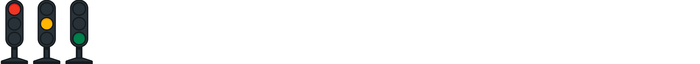
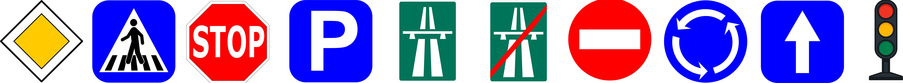

# Visión artificial

El subsistema de percepción nació como trabajo práctico de la materia **Visión
Artificial** (primer cuatrimestre 2025) y terminó siendo el detector que corre
arriba del auto. La historia completa está en [Cómo llegamos acá](../timeline.md).

## Qué detecta

**Semáforos** — `lightred`, `lightyellow`, `lightgreen`

**Señales de tránsito BFMC** — `priority`, `crosswalk`, `stop`, `parking`,
`highway_entry`, `highway_exit`, `no_entry`, `roundabout`, `onewayroad`, `trafficlight`

## Cómo se llegó al modelo

1. **Exploración con YOLOv5 preentrenado.** Antes de tocar datos propios, entender
   el flujo completo: inferencia, salida, visualización.
2. **YOLOv8-m sobre datasets propios.** Dos datasets de Roboflow —uno de semáforos,
   otro de señales BFMC— fusionados, reescalados y unificados.
3. **Entrenamiento en Google Colab.** Notebooks versionados en el repo
   `vision-artificial`.
4. **Compilación a TensorRT.** Sobre la Jetson, el `.pt` se exporta a `.engine`
   para sostener el framerate en tiempo real.

## Los informes

- **[Informe comparativo — dataset fusionado](informe-comparativo.md)**
  Semáforos + señales. mAP@0.5 de 0.995 desde la primera época, con videos de
  prueba sobre el auto BFMC.
- **[Informe — detección de semáforos](informe-semaforos.md)**
  Solo luces. Curva de aprendizaje clara: 0.482 → 0.923 → 0.986 entre 1, 10 y 50
  épocas.

!!! warning "Cómo leer estas métricas"
    Las métricas del dataset fusionado son sospechosamente altas. Las imágenes de
    maqueta son limpias, con fondo controlado y objetos grandes y nítidos: el
    problema es fácil para el modelo. Los números son correctos, pero no
    anticiparon los falsos positivos que aparecieron después con luz ambiente
    exterior, ya con el auto en pista.
